# 🤖 Agentic AI — Complete Learning Path

**From zero to production AI agents.** 7 modules, 20+ lessons, 8 runnable projects.

---

## 📚 Module 1: Foundations (Theory)

> *What are LLMs? What makes an AI "agentic"? The mental models you need before writing code.*

| # | Lesson | Key Takeaway |
|---|--------|--------------|
| 1.1 | [What is an LLM?](./lessons/1.1-what-is-llm.md) | LLMs predict next tokens; they're powerful but have no memory, no tools, no action |
| 1.2 | [Agents vs Chatbots](./lessons/1.2-agents-vs-chatbots.md) | Agents = LLM + Tools + Memory + Planning. Chatbots just talk; agents *do* |
| 1.3 | [The 4 Pillars](./lessons/1.3-four-pillars.md) | Reasoning, Memory, Tools, Planning — the anatomy of every agent |
| 1.4 | [The Agent Loop](./lessons/1.4-agent-loop.md) | Perceive → Think → Act → Observe → Repeat. This loop IS the agent |

---

## 🛠️ Module 2: Setup & First Code

> *Get your environment ready and make your first API call.*

| # | Lesson | Code |
|---|--------|------|
| 2.1 | [Python Basics Refresher](./lessons/2.1-python-basics.md) | — |
| 2.2 | [Environment Setup](./lessons/2.2-setup-environment.md) | — |
| 2.3 | [Your First LLM Call](./lessons/2.3-first-llm-call.md) | [`first_llm_call.py`](./code/first_llm_call.py) |

```bash
python agentic-ai-learning/code/first_llm_call.py
```

---

## 🔧 Module 3: Core Building Blocks

> *The 3 skills every agent developer needs: function calling, the agent loop, memory.*

| # | Lesson | Code |
|---|--------|------|
| 3.1 | [Function Calling](./lessons/3.1-function-calling.md) | [`function_calling_demo.py`](./code/function_calling_demo.py) |
| 3.2 | [Agent Loop from Scratch](./lessons/3.2-simple-agent-loop.md) | [`simple_agent_loop.py`](./code/simple_agent_loop.py) |
| 3.3 | [Memory & Context](./lessons/3.3-memory.md) | — |

```bash
python agentic-ai-learning/code/function_calling_demo.py
python agentic-ai-learning/code/simple_agent_loop.py
```

---

## 🧠 Module 4: Frameworks & Real Projects

> *Stop building from scratch. Use the OpenAI Agents SDK, then build a real project.*

| # | Lesson | Code |
|---|--------|------|
| 4.1 | [OpenAI Agents SDK](./lessons/4.1-openai-agents-sdk.md) | [`agents_sdk_demo.py`](./code/agents_sdk_demo.py) |
| 4.2 | [Real Project: Research Agent](./lessons/4.2-real-project.md) | [`research_agent.py`](./code/research_agent.py) |

```bash
pip install openai-agents
python agentic-ai-learning/code/agents_sdk_demo.py
python agentic-ai-learning/code/research_agent.py
```

---

## 🤝 Module 5: Multi-Agent Systems

> *One agent is powerful. Multiple agents working together are transformative.*

| # | Lesson | Code |
|---|--------|------|
| 5.1 | [Multi-Agent Patterns](./lessons/5.1-multi-agent.md) | [`multi_agent_pipeline.py`](./code/multi_agent_pipeline.py) |

**Patterns covered:** Pipeline (sequential), Debate (adversarial), Handoffs (delegation)

```bash
python agentic-ai-learning/code/multi_agent_pipeline.py
```

---

## 🏭 Module 6: Production & Advanced

> *The gap between "demo" and "product." Structured data, RAG, streaming, real APIs.*

| # | Lesson | Topic |
|---|--------|-------|
| 6.1 | [Structured Outputs](./lessons/6.1-structured-outputs.md) | Pydantic models, JSON mode, type-safe LLM responses |
| 6.2 | [RAG](./lessons/6.2-rag.md) | Embeddings, vector DBs, chunking, retrieval-augmented generation |
| 6.3 | [Streaming & Error Handling](./lessons/6.3-streaming-errors.md) | Real-time output, retries, timeouts, cost control |
| 6.4 | [Real API Integration](./lessons/6.4-real-apis.md) | Wikipedia, weather, GitHub — connecting agents to the real world |

---

## 🎓 Module 7: Capstone

> *Combine everything into one production-ready application.*

| # | Lesson | Code |
|---|--------|------|
| 7.1 | [Capstone: Personal AI Assistant](./lessons/7.1-capstone.md) | [`capstone_assistant.py`](./code/capstone_assistant.py) |

**Features:** 6 tools, real APIs (Wikipedia + weather), persistent notes, token budgets, retry logic, conversation memory.

```bash
python agentic-ai-learning/code/capstone_assistant.py
```

---

## 🗺️ Learning Path Visualization

```mermaid
flowchart LR
    M1["📚 Module 1<br/>THEORY<br/>(what/why)"]
    M2["🛠️ Module 2<br/>SETUP<br/>(env/api)"]
    M3["🔧 Module 3<br/>CORE SKILLS<br/>(loop/tools/mem)"]
    M4["🧠 Module 4<br/>FRAMEWORKS<br/>(SDK/project)"]
    M5["🤝 Module 5<br/>MULTI-AGENT<br/>(pipeline/debate)"]
    M6["🏭 Module 6<br/>PRODUCTION<br/>(RAG/stream/API)"]
    M7["🎓 Module 7<br/>CAPSTONE<br/>(real app)"]
    
    M1 --> M2 --> M3 --> M4
    M4 --> M5 --> M6 --> M7
    
    style M1 fill:#e3f2fd,stroke:#1565c0,stroke-width:2px
    style M2 fill:#e8f5e9,stroke:#388e3c,stroke-width:2px
    style M3 fill:#fff3e0,stroke:#e65100,stroke-width:2px
    style M4 fill:#f3e5f5,stroke:#7b1fa2,stroke-width:2px
    style M5 fill:#fce4ec,stroke:#c2185b,stroke-width:2px
    style M6 fill:#e0f2f1,stroke:#00695c,stroke-width:2px
    style M7 fill:#fffde7,stroke:#f9a825,stroke-width:2px
```



---

## ⚡ Quick Start

```bash
# 1. Install dependencies
pip install openai python-dotenv requests

# 2. Set your API key
echo "OPENAI_API_KEY=sk-..." > .env

# 3. Start learning (read lessons in order, run code after each)
python agentic-ai-learning/code/first_llm_call.py        # Module 2
python agentic-ai-learning/code/function_calling_demo.py  # Module 3
python agentic-ai-learning/code/simple_agent_loop.py      # Module 3
python agentic-ai-learning/code/agents_sdk_demo.py        # Module 4
python agentic-ai-learning/code/research_agent.py         # Module 4
python agentic-ai-learning/code/multi_agent_pipeline.py   # Module 5
python agentic-ai-learning/code/capstone_assistant.py     # Module 7
```

---

## 📖 How to Study

1. **Read** the lesson markdown file
2. **Run** the corresponding code
3. **Modify** the code — change prompts, add tools, break things
4. **Do the exercises** at the end of each lesson
5. **Build your own** version before moving to the next module

---

## 🎯 What You'll Be Able to Do After This Course

- ✅ Explain how AI agents work (architecture, patterns, tradeoffs)
- ✅ Build agents from scratch (no framework needed)
- ✅ Use the OpenAI Agents SDK for production apps
- ✅ Implement RAG (search your own documents)
- ✅ Design multi-agent systems (pipeline, debate, handoffs)
- ✅ Handle production concerns (streaming, errors, costs, security)
- ✅ Integrate real-world APIs as agent tools
- ✅ Ship a complete AI assistant application