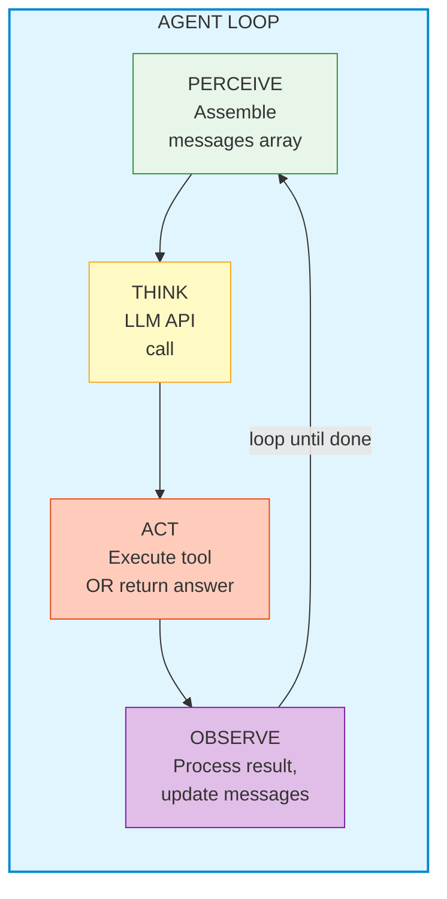
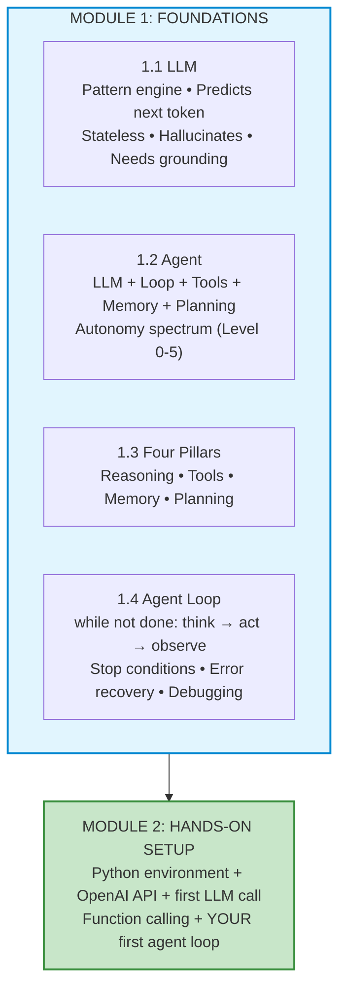

# 📚 Lesson 1.4 — The Agent Loop: Complete Implementation Guide

## 🎯 What You'll Actually Understand After This

Not just "perceive → think → act → observe" — you'll understand:
- The **exact API message flow** through multiple iterations (with real JSON)
- **How to implement the loop** in production-quality Python
- **Stop conditions** — all the ways a loop ends (and fails to end)
- **Debugging** — how to trace what the agent is "thinking"
- **Error recovery** — what happens when tools fail mid-loop
- **Parallel tool calls** — when the LLM requests multiple tools at once
- **Cost tracking** — how to monitor token usage across iterations

---

## Part 1: The Loop Anatomy (Technical View)

### The Conceptual Loop



### What Actually Happens at Each Stage

| Stage | What Happens | Code Equivalent |
|-------|-------------|-----------------|
| **PERCEIVE** | Build the `messages` array from memory | `messages = memory.get_messages()` |
| **THINK** | Call the LLM API with messages + tools | `response = client.chat.completions.create(...)` |
| **ACT** | Either execute tool(s) or return final answer | `if tool_calls: execute() else: return answer` |
| **OBSERVE** | Append tool results to messages | `messages.append(tool_result)` |

### The Loop in Pseudocode

```python
def agent_loop(goal: str, tools: list, max_iterations: int = 10) -> str:
    messages = [system_prompt, user_message(goal)]
    
    for i in range(max_iterations):
        # PERCEIVE + THINK (combined in one API call)
        response = call_llm(messages, tools)
        
        # ACT: Check what the LLM decided
        if response.has_tool_calls:
            # Agent wants to use tools → continue looping
            messages.append(assistant_message_with_tools)
            
            for tool_call in response.tool_calls:
                result = execute_tool(tool_call)
                messages.append(tool_result_message(result))
            # → loops back to PERCEIVE
            
        else:
            # Agent produced final answer → EXIT LOOP
            return response.content
    
    # Safety: max iterations reached
    return "Unable to complete within step limit"
```

---

## Part 2: The Complete Implementation

### Production-Quality Agent Loop

```python
import json
import time
from dataclasses import dataclass, field
from openai import OpenAI

client = OpenAI()


@dataclass
class AgentConfig:
    """Configuration for the agent loop."""
    model: str = "gpt-4o"
    max_iterations: int = 10
    temperature: float = 0.1
    max_tokens: int = 4096
    verbose: bool = True  # Print debug info


@dataclass
class LoopStats:
    """Track what happened during the loop."""
    iterations: int = 0
    total_input_tokens: int = 0
    total_output_tokens: int = 0
    tool_calls_made: list = field(default_factory=list)
    errors: list = field(default_factory=list)
    start_time: float = 0
    end_time: float = 0
    
    @property
    def duration(self) -> float:
        return self.end_time - self.start_time
    
    @property
    def estimated_cost(self) -> float:
        # GPT-4o pricing: $2.50/1M input, $10/1M output
        input_cost = self.total_input_tokens * 2.50 / 1_000_000
        output_cost = self.total_output_tokens * 10.00 / 1_000_000
        return input_cost + output_cost


def agent_loop(
    goal: str,
    tools: list[dict],
    tool_executors: dict,  # {tool_name: callable}
    system_prompt: str,
    config: AgentConfig = None
) -> tuple[str, LoopStats]:
    """
    Run the agent loop until completion.
    
    Returns: (final_answer, stats)
    """
    config = config or AgentConfig()
    stats = LoopStats(start_time=time.time())
    
    # Initialize messages
    messages = [
        {"role": "system", "content": system_prompt},
        {"role": "user", "content": goal}
    ]
    
    if config.verbose:
        print(f"\n{'='*60}")
        print(f"🎯 GOAL: {goal}")
        print(f"{'='*60}")
    
    # ═══════════════════════════════════════════════════════
    # THE AGENT LOOP
    # ═══════════════════════════════════════════════════════
    
    for iteration in range(config.max_iterations):
        stats.iterations = iteration + 1
        
        if config.verbose:
            print(f"\n{'─'*60}")
            print(f"📍 ITERATION {iteration + 1}")
            print(f"{'─'*60}")
        
        # ─── PERCEIVE + THINK ───────────────────────────────
        # Call the LLM with current context
        try:
            response = client.chat.completions.create(
                model=config.model,
                messages=messages,
                tools=tools if tools else None,
                temperature=config.temperature,
                max_tokens=config.max_tokens
            )
        except Exception as e:
            stats.errors.append(f"API call failed: {e}")
            if config.verbose:
                print(f"❌ API Error: {e}")
            break
        
        # Track token usage
        if response.usage:
            stats.total_input_tokens += response.usage.prompt_tokens
            stats.total_output_tokens += response.usage.completion_tokens
            if config.verbose:
                print(f"📊 Tokens: {response.usage.prompt_tokens} in, "
                      f"{response.usage.completion_tokens} out")
        
        message = response.choices[0].message
        
        # ─── ACT: Decision Point ────────────────────────────
        
        if message.tool_calls:
            # ═══ PATH A: Agent wants to use tools ═══
            
            if config.verbose:
                print(f"🧠 Agent reasoning: {message.content or '(thinking...)'}")
                print(f"🛠️  Tool calls requested: {len(message.tool_calls)}")
            
            # Add assistant message (with tool calls) to history
            messages.append({
                "role": "assistant",
                "content": message.content,
                "tool_calls": [
                    {
                        "id": tc.id,
                        "type": "function",
                        "function": {
                            "name": tc.function.name,
                            "arguments": tc.function.arguments
                        }
                    }
                    for tc in message.tool_calls
                ]
            })
            
            # Execute each tool call
            for tool_call in message.tool_calls:
                func_name = tool_call.function.name
                func_args = json.loads(tool_call.function.arguments)
                
                if config.verbose:
                    print(f"   ⚙️  Calling: {func_name}({func_args})")
                
                stats.tool_calls_made.append({
                    "name": func_name,
                    "args": func_args,
                    "iteration": iteration + 1
                })
                
                # Execute the tool
                try:
                    if func_name in tool_executors:
                        result = tool_executors[func_name](**func_args)
                    else:
                        result = f"Error: Unknown tool '{func_name}'"
                        stats.errors.append(f"Unknown tool: {func_name}")
                except Exception as e:
                    result = f"Error executing {func_name}: {str(e)}"
                    stats.errors.append(result)
                
                if config.verbose:
                    # Truncate long results for display
                    display_result = str(result)[:200] + "..." if len(str(result)) > 200 else result
                    print(f"   📋 Result: {display_result}")
                
                # ─── OBSERVE: Add result to messages ────────
                messages.append({
                    "role": "tool",
                    "tool_call_id": tool_call.id,
                    "content": str(result)
                })
            
            # → Loop continues (back to PERCEIVE)
        
        else:
            # ═══ PATH B: Agent produced final answer ═══
            
            final_answer = message.content
            
            if config.verbose:
                print(f"\n✅ FINAL ANSWER (iteration {iteration + 1}):")
                print(f"{'─'*60}")
                print(final_answer)
                print(f"{'─'*60}")
            
            stats.end_time = time.time()
            return final_answer, stats
    
    # ═══ SAFETY: Max iterations reached ═══
    stats.end_time = time.time()
    fallback = "I wasn't able to complete this task within the step limit. Here's what I found so far based on my research."
    
    if config.verbose:
        print(f"\n⚠️  MAX ITERATIONS ({config.max_iterations}) REACHED")
    
    return fallback, stats
```

---

## Part 3: Tracing a Real Execution

### Example: Weather + Advice Agent

```python
# Define tools
tools = [
    {
        "type": "function",
        "function": {
            "name": "get_weather",
            "description": "Get current weather for a city",
            "parameters": {
                "type": "object",
                "properties": {
                    "city": {"type": "string", "description": "City name"}
                },
                "required": ["city"]
            }
        }
    },
    {
        "type": "function",
        "function": {
            "name": "get_forecast",
            "description": "Get 5-day forecast for a city",
            "parameters": {
                "type": "object",
                "properties": {
                    "city": {"type": "string"},
                    "days": {"type": "integer", "default": 5}
                },
                "required": ["city"]
            }
        }
    }
]

# Tool implementations
def get_weather(city: str) -> str:
    # In reality, call a weather API
    return json.dumps({
        "city": city,
        "temp_c": 14,
        "condition": "light rain",
        "humidity": 85,
        "wind_kph": 20,
        "rain_chance": 80
    })

def get_forecast(city: str, days: int = 5) -> str:
    return json.dumps({
        "city": city,
        "forecast": [
            {"day": "Mon", "high": 15, "low": 9, "rain": 80},
            {"day": "Tue", "high": 17, "low": 10, "rain": 40},
            {"day": "Wed", "high": 19, "low": 11, "rain": 20},
        ]
    })

# Run the agent
system_prompt = """You are a weather assistant. Help users understand the weather
and make decisions about their day.

Rules:
- Always check current weather before advising
- Check forecast if the user asks about future days
- Give practical advice (umbrella? jacket? sunscreen?)
- Be concise and friendly
"""

answer, stats = agent_loop(
    goal="What's the weather in London? Should I bring an umbrella this week?",
    tools=tools,
    tool_executors={"get_weather": get_weather, "get_forecast": get_forecast},
    system_prompt=system_prompt,
    config=AgentConfig(verbose=True)
)

print(f"\n📈 Stats: {stats.iterations} iterations, "
      f"{len(stats.tool_calls_made)} tool calls, "
      f"${stats.estimated_cost:.4f} cost, "
      f"{stats.duration:.1f}s")
```

### The Execution Trace (What You'd See)

```
============================================================
🎯 GOAL: What's the weather in London? Should I bring an umbrella this week?
============================================================

────────────────────────────────────────────────────────────
📍 ITERATION 1
────────────────────────────────────────────────────────────
📊 Tokens: 187 in, 52 out
🧠 Agent reasoning: I'll check the current weather in London first, then look at the forecast for the week.
🛠️  Tool calls requested: 2
   ⚙️  Calling: get_weather({"city": "London"})
   📋 Result: {"city": "London", "temp_c": 14, "condition": "light rain", ...}
   ⚙️  Calling: get_forecast({"city": "London", "days": 5})
   📋 Result: {"city": "London", "forecast": [{"day": "Mon", ...}]}

────────────────────────────────────────────────────────────
📍 ITERATION 2
────────────────────────────────────────────────────────────
📊 Tokens: 412 in, 95 out

✅ FINAL ANSWER (iteration 2):
────────────────────────────────────────────────────────────
London is currently 14°C with light rain, 85% humidity, and 20km/h winds.

For the week:
- Monday: 80% rain chance → ☔ Bring umbrella
- Tuesday: 40% rain chance → 🌤️ Maybe
- Wednesday: 20% rain chance → ☀️ Probably fine

My advice: Yes, definitely bring an umbrella today and tomorrow. By Wednesday you should be fine!

📈 Stats: 2 iterations, 2 tool calls, $0.0031 cost, 3.2s
```

### The Messages Array (What the LLM Actually Saw)

After iteration 1, the messages array looks like this:

```python
messages = [
    # Message 0: System prompt
    {"role": "system", "content": "You are a weather assistant..."},
    
    # Message 1: User goal
    {"role": "user", "content": "What's the weather in London? Should I bring an umbrella this week?"},
    
    # Message 2: Assistant's decision to use tools
    {
        "role": "assistant",
        "content": "I'll check the current weather in London first, then look at the forecast for the week.",
        "tool_calls": [
            {
                "id": "call_abc123",
                "type": "function",
                "function": {"name": "get_weather", "arguments": "{\"city\": \"London\"}"}
            },
            {
                "id": "call_def456",
                "type": "function",
                "function": {"name": "get_forecast", "arguments": "{\"city\": \"London\", \"days\": 5}"}
            }
        ]
    },
    
    # Message 3: First tool result
    {
        "role": "tool",
        "tool_call_id": "call_abc123",
        "content": "{\"city\": \"London\", \"temp_c\": 14, \"condition\": \"light rain\", ...}"
    },
    
    # Message 4: Second tool result
    {
        "role": "tool",
        "tool_call_id": "call_def456",
        "content": "{\"city\": \"London\", \"forecast\": [...]}"
    }
    
    # → This full array is sent to the LLM in iteration 2
]
```

**Key insight:** The LLM sees the ENTIRE conversation history every time. It doesn't "remember" — you resend everything.

---

## Part 4: Stop Conditions (All the Ways a Loop Ends)

### The 6 Stop Conditions

```python
# 1. NATURAL COMPLETION: LLM returns text without tool calls
if not message.tool_calls:
    return message.content  # ✅ Happy path

# 2. MAX ITERATIONS: Safety valve
for i in range(max_iterations):
    ...
return "Step limit reached"  # ⚠️ Prevents infinite loops

# 3. TOKEN BUDGET: Cost control
if stats.total_input_tokens + stats.total_output_tokens > max_tokens_budget:
    return "Token budget exceeded"  # 💰 Prevents runaway costs

# 4. TIME LIMIT: Latency control
if time.time() - start_time > max_seconds:
    return "Time limit exceeded"  # ⏱️ Prevents hanging

# 5. UNRECOVERABLE ERROR: API failure, auth error
except AuthenticationError:
    raise  # 🔑 Don't retry auth errors

# 6. HUMAN INTERRUPTION: User cancels
if user_cancelled:
    return "Cancelled by user"  # 🛑 User control
```

### Production Stop Condition Implementation

```python
@dataclass
class LoopLimits:
    """All the ways to stop the loop."""
    max_iterations: int = 10
    max_tokens_budget: int = 100_000  # Total tokens across all calls
    max_seconds: float = 120.0        # 2 minutes
    max_tool_errors: int = 3          # Stop after 3 consecutive tool failures


def should_stop(stats: LoopStats, limits: LoopLimits) -> tuple[bool, str]:
    """Check all stop conditions. Returns (should_stop, reason)."""
    
    if stats.iterations >= limits.max_iterations:
        return True, f"Max iterations ({limits.max_iterations}) reached"
    
    total_tokens = stats.total_input_tokens + stats.total_output_tokens
    if total_tokens >= limits.max_tokens_budget:
        return True, f"Token budget ({limits.max_tokens_budget}) exceeded"
    
    if stats.duration >= limits.max_seconds:
        return True, f"Time limit ({limits.max_seconds}s) exceeded"
    
    consecutive_errors = count_consecutive_errors(stats.errors)
    if consecutive_errors >= limits.max_tool_errors:
        return True, f"Too many consecutive errors ({consecutive_errors})"
    
    return False, ""
```

---

## Part 5: Error Recovery in the Loop

### The Problem

Tools fail. APIs timeout. Arguments are wrong. A robust agent loop handles this gracefully.

### Error Recovery Strategy

```python
def execute_tool_with_recovery(
    func_name: str,
    func_args: dict,
    tool_executors: dict,
    max_retries: int = 2
) -> str:
    """Execute a tool with retry and error formatting."""
    
    for attempt in range(max_retries + 1):
        try:
            if func_name not in tool_executors:
                return f"Error: Tool '{func_name}' does not exist. Available tools: {list(tool_executors.keys())}"
            
            result = tool_executors[func_name](**func_args)
            return str(result)
        
        except TypeError as e:
            # Wrong arguments — tell the LLM what went wrong
            return f"Error: Invalid arguments for {func_name}. {str(e)}. Please check the parameter types and try again."
        
        except TimeoutError:
            if attempt < max_retries:
                time.sleep(1)  # Brief pause before retry
                continue
            return f"Error: {func_name} timed out after {max_retries} retries. Try a simpler query or different approach."
        
        except Exception as e:
            return f"Error executing {func_name}: {str(e)}"
    
    return f"Error: {func_name} failed after all retries."
```

### How the LLM Sees Errors

The key insight: **return errors as tool results, not exceptions.** The LLM can then reason about the error and try a different approach.

```python
# BAD: Exception crashes the loop
result = tool_executors[func_name](**func_args)  # Raises exception → loop dies

# GOOD: Error becomes information for the LLM
result = execute_tool_with_recovery(func_name, func_args, tool_executors)
# Returns: "Error: Invalid arguments. 'city' is required. Please try again."
# LLM sees this and can fix its approach!
```

### Example: LLM Recovering from an Error

```
Iteration 1:
  LLM calls: get_weather(city="")  ← empty string!
  Tool returns: "Error: 'city' cannot be empty. Please provide a valid city name."

Iteration 2:
  LLM calls: get_weather(city="London")  ← fixed it!
  Tool returns: {"temp_c": 14, ...}
```

The LLM **learned from the error** because we fed it back as context.

---

## Part 6: Parallel Tool Calls

### When the LLM Requests Multiple Tools

GPT-4o can request multiple tools in a single response:

```json
{
    "tool_calls": [
        {"id": "call_1", "function": {"name": "get_weather", "arguments": "{\"city\": \"London\"}"}},
        {"id": "call_2", "function": {"name": "get_weather", "arguments": "{\"city\": \"Paris\"}"}},
        {"id": "call_3", "function": {"name": "get_forecast", "arguments": "{\"city\": \"London\"}"}}
    ]
}
```

### Sequential vs Parallel Execution

```python
# SEQUENTIAL (simple, slow):
for tool_call in message.tool_calls:
    result = execute_tool(tool_call)
    messages.append(tool_result(tool_call.id, result))

# PARALLEL (fast, for independent tools):
import concurrent.futures

def execute_parallel(tool_calls, tool_executors):
    with concurrent.futures.ThreadPoolExecutor(max_workers=5) as executor:
        futures = {
            executor.submit(execute_tool, tc, tool_executors): tc
            for tc in tool_calls
        }
        results = {}
        for future in concurrent.futures.as_completed(futures):
            tc = futures[future]
            results[tc.id] = future.result()
    return results

# Use parallel when tools are independent (no data dependencies)
# Use sequential when tool B needs tool A's result
```

### Important: Order of Tool Results

Tool results MUST be added in the same order as tool_calls, with matching IDs:

```python
# The API requires this exact structure:
messages.append({"role": "assistant", "content": ..., "tool_calls": [...]})
messages.append({"role": "tool", "tool_call_id": "call_1", "content": "result 1"})
messages.append({"role": "tool", "tool_call_id": "call_2", "content": "result 2"})
messages.append({"role": "tool", "tool_call_id": "call_3", "content": "result 3"})
# Each tool_call_id MUST match the corresponding tool_call's id
```

---

## Part 7: Debugging the Loop

### The Debug Toolkit

```python
class AgentDebugger:
    """Tools for understanding what your agent is doing."""
    
    @staticmethod
    def print_messages(messages: list[dict]):
        """Pretty-print the messages array."""
        for i, msg in enumerate(messages):
            role = msg["role"].upper()
            content = msg.get("content", "")[:100]
            tool_calls = msg.get("tool_calls", [])
            
            print(f"[{i}] {role}: {content}")
            if tool_calls:
                for tc in tool_calls:
                    print(f"     → {tc['function']['name']}({tc['function']['arguments']})")
    
    @staticmethod
    def save_trace(messages: list[dict], stats: LoopStats, filename: str):
        """Save full execution trace to file for analysis."""
        trace = {
            "messages": messages,
            "stats": {
                "iterations": stats.iterations,
                "tokens_in": stats.total_input_tokens,
                "tokens_out": stats.total_output_tokens,
                "tool_calls": stats.tool_calls_made,
                "errors": stats.errors,
                "duration": stats.duration,
                "cost": stats.estimated_cost
            }
        }
        with open(filename, "w") as f:
            json.dump(trace, f, indent=2)
    
    @staticmethod
    def detect_infinite_loop(tool_calls: list, window: int = 3) -> bool:
        """Detect if the agent is repeating the same actions."""
        if len(tool_calls) < window:
            return False
        
        recent = tool_calls[-window:]
        # Check if last N calls are identical
        return all(
            tc["name"] == recent[0]["name"] and tc["args"] == recent[0]["args"]
            for tc in recent
        )
```

### Common Debugging Scenarios

| Symptom | Likely Cause | Fix |
|---------|-------------|-----|
| Infinite loop (same tool, same args) | LLM not learning from results | Add "you already tried this" to context |
| Wrong tool selected | Vague tool descriptions | Improve descriptions + add examples |
| Too many iterations | Task too complex for single agent | Decompose into sub-agents |
| Empty final answer | LLM confused by long context | Summarize old messages |
| API rate limit error | Too many calls too fast | Add `time.sleep(0.5)` between calls |

---

## Part 8: Loop Variations

### Variation 1: Streaming Loop (Show Progress)

```python
def agent_loop_streaming(goal, tools, tool_executors, system_prompt):
    """Show the user what's happening in real-time."""
    messages = [{"role": "system", "content": system_prompt},
                {"role": "user", "content": goal}]
    
    for iteration in range(10):
        # Use streaming for the LLM response
        stream = client.chat.completions.create(
            model="gpt-4o",
            messages=messages,
            tools=tools,
            stream=True
        )
        
        # Collect streamed response
        full_content = ""
        tool_calls_data = {}
        
        for chunk in stream:
            delta = chunk.choices[0].delta
            if delta.content:
                print(delta.content, end="", flush=True)  # Stream to user
                full_content += delta.content
            # ... handle tool_calls in stream ...
        
        # Continue loop as normal...
```

### Variation 2: Human-in-the-Loop

```python
def agent_loop_with_approval(goal, tools, tool_executors, system_prompt):
    """Ask for human approval before dangerous actions."""
    
    DANGEROUS_TOOLS = {"send_email", "delete_file", "execute_code"}
    
    # ... in the loop:
    for tool_call in message.tool_calls:
        func_name = tool_call.function.name
        
        if func_name in DANGEROUS_TOOLS:
            print(f"\n⚠️  Agent wants to call: {func_name}({func_args})")
            approval = input("Approve? (y/n): ")
            if approval.lower() != 'y':
                result = "Action denied by user. Choose a different approach."
            else:
                result = execute_tool(func_name, func_args)
        else:
            result = execute_tool(func_name, func_args)
```

### Variation 3: Recursive Agent (Agent Calls Agent)

```python
def research_agent(goal):
    """High-level agent that delegates to sub-agents."""
    
    tools = [
        {
            "type": "function",
            "function": {
                "name": "delegate_search",
                "description": "Delegate a search task to the search sub-agent",
                "parameters": {
                    "type": "object",
                    "properties": {
                        "query": {"type": "string"}
                    }
                }
            }
        }
    ]
    
    def delegate_search(query: str) -> str:
        # This runs ANOTHER agent loop!
        sub_answer, _ = agent_loop(
            goal=f"Search for: {query}",
            tools=search_tools,
            tool_executors=search_executors,
            system_prompt="You are a search specialist."
        )
        return sub_answer
    
    return agent_loop(goal, tools, {"delegate_search": delegate_search}, system_prompt)
```

---

## Part 9: Module 1 Complete — The Full Picture



---

## ✅ Deep Understanding Check

1. **Message flow:** After 3 iterations with 2 tool calls each, how many messages are in the array? (Count: system + user + 3×(assistant + 2×tool))

2. **Stop conditions:** Your agent is stuck in an infinite loop calling `search("AI agents")` repeatedly. What are 3 ways to fix this?

3. **Error recovery:** A tool returns "Error: API key invalid". Should you retry? Why or why not?

4. **Parallel calls:** The LLM requests `get_weather("London")` and `get_weather("Paris")` in the same response. Can you execute these in parallel? What about `search("X")` followed by `read_page(result_url)`?

5. **Cost:** An agent uses 5 iterations, each with ~3000 input tokens and ~500 output tokens. At GPT-4o pricing ($2.50/1M in, $10/1M out), what's the total cost?

---

## 🔬 Go Deeper

- **OpenAI Function Calling Guide** — official documentation
- **LangGraph** — production agent loop framework
- **"Building effective agents" (Anthropic)** — loop patterns
- **AutoGPT source code** — see a real (complex) agent loop

---

**Previous:** [Lesson 1.3 — The 4 Pillars](./1.3-four-pillars.md)
**Next:** [Lesson 2.1 — Python Basics Refresher](./2.1-python-basics.md)