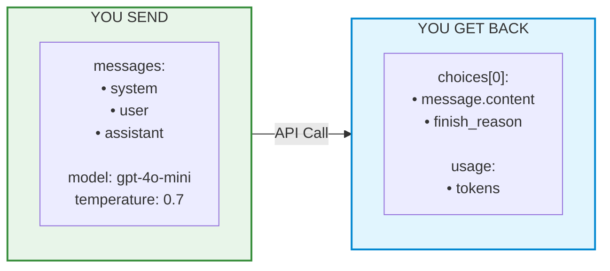

# 📚 Lesson 2.3 — Your First LLM Call (From "Hello" to Mini Chatbot)

## 🎯 What You'll Build

By the end of this lesson, you'll have:
1. ✅ Made your first API call to GPT (3 lines of code!)
2. ✅ Understood every parameter you can control
3. ✅ Built a working CLI chatbot with memory

**Time:** ~30 minutes  
**Prerequisites:** Lesson 2.2 (setup complete, `test_setup.py` works)

---

## 🚀 Quick Win: 3 Lines to Talk to AI

Create `hello_ai.py`:

```python
from dotenv import load_dotenv
from openai import OpenAI
load_dotenv()

client = OpenAI()
response = client.chat.completions.create(
    model="gpt-4o-mini",
    messages=[{"role": "user", "content": "Say hello in 3 languages!"}]
)
print(response.choices[0].message.content)
```

Run it:
```bash
python hello_ai.py
```

**🎉 You just talked to GPT-4o-mini!** That's the whole foundation. Everything else is building on this.

---

## 🔬 Dissecting the Call: What Just Happened?

### The request (what you sent):

```python
client.chat.completions.create(
    model="gpt-4o-mini",        # ← WHICH brain to use
    messages=[                   # ← WHAT conversation to respond to
        {"role": "user", "content": "Say hello in 3 languages!"}
    ]
)
```

### The response (what came back):

```python
response
├── .choices[0]
│   ├── .message
│   │   ├── .role        → "assistant"  (who said it)
│   │   └── .content     → "Hello! Bonjour! Namaste!"  (THE ANSWER)
│   └── .finish_reason   → "stop"  (why it stopped talking)
│
├── .usage
│   ├── .prompt_tokens   → 18  (what you sent)
│   ├── .completion_tokens → 12  (what it generated)
│   └── .total_tokens    → 30  (what you're billed for)
│
├── .model               → "gpt-4o-mini-2024-07-18"
└── .id                  → "chatcmpl-abc123..."
```

### 🧪 TRY IT: Inspect the full response

```python
from dotenv import load_dotenv
from openai import OpenAI
load_dotenv()
client = OpenAI()

response = client.chat.completions.create(
    model="gpt-4o-mini",
    messages=[{"role": "user", "content": "What is 2+2?"}]
)

# Explore everything:
print(f"Answer: {response.choices[0].message.content}")
print(f"Role: {response.choices[0].message.role}")
print(f"Finish reason: {response.choices[0].finish_reason}")
print(f"Model used: {response.model}")
print(f"Tokens: {response.usage.total_tokens} total")
print(f"  - Input: {response.usage.prompt_tokens}")
print(f"  - Output: {response.usage.completion_tokens}")
```

---

## 🎛️ The Control Panel: Parameters You Can Tune

### The full call with all useful parameters:

```python
response = client.chat.completions.create(
    # ─── REQUIRED ───────────────────────────────
    model="gpt-4o-mini",          # Which model
    messages=[...],               # The conversation
    
    # ─── OPTIONAL (but useful) ──────────────────
    temperature=0.7,              # Creativity (0=focused, 2=wild)
    max_tokens=500,               # Max response length
    top_p=1.0,                    # Nucleus sampling (usually leave at 1)
    
    # ─── ADVANCED ───────────────────────────────
    stop=["\n\n"],                # Stop generating at this text
    presence_penalty=0.0,         # Penalize repetition (-2 to 2)
    frequency_penalty=0.0,        # Penalize word reuse (-2 to 2)
)
```

### Temperature: The Creativity Dial

```python
# temperature=0 → Same answer every time (deterministic)
# temperature=0.7 → Balanced (good default)
# temperature=1.5 → Creative/chaotic

# Try it:
for temp in [0, 0.7, 1.5]:
    response = client.chat.completions.create(
        model="gpt-4o-mini",
        messages=[{"role": "user", "content": "Give me a creative name for a coffee shop"}],
        temperature=temp
    )
    print(f"temp={temp}: {response.choices[0].message.content}")
```

### 🧪 TRY IT: Feel the temperature

```python
from dotenv import load_dotenv
from openai import OpenAI
load_dotenv()
client = OpenAI()

prompt = "Write a one-line tagline for a tech startup"

print("Same prompt, different temperatures:\n")
for temp in [0, 0.5, 1.0, 1.5]:
    response = client.chat.completions.create(
        model="gpt-4o-mini",
        messages=[{"role": "user", "content": prompt}],
        temperature=temp,
        max_tokens=30
    )
    print(f"  🌡️ {temp}: {response.choices[0].message.content}")
```

---

## 💬 The Messages Array: How AI "Remembers"

### The key insight:

> **The AI has NO memory.** Every call is independent. "Memory" = you resend the whole conversation.

### Single message (no context):

```python
messages = [
    {"role": "user", "content": "What's my name?"}
]
# AI: "I don't know your name!" (it has no context)
```

### Multi-turn (with context):

```python
messages = [
    {"role": "system", "content": "You are a friendly assistant."},
    {"role": "user", "content": "My name is Vikiev."},
    {"role": "assistant", "content": "Nice to meet you, Vikiev!"},
    {"role": "user", "content": "What's my name?"},  # ← NOW it knows!
]
# AI: "Your name is Vikiev!" (it sees the history)
```

### The three roles:

| Role | Who | Purpose | Example |
|------|-----|---------|---------|
| `system` | You (the developer) | Set personality, rules, constraints | "You are a pirate. Always rhyme." |
| `user` | The end user | Their question/input | "What's the weather?" |
| `assistant` | The AI | Its previous responses | "Arr! 'Tis sunny, matey!" |

### 🧪 TRY IT: System prompt magic

```python
from dotenv import load_dotenv
from openai import OpenAI
load_dotenv()
client = OpenAI()

# Same question, different system prompts:
personalities = [
    "You are a helpful assistant.",
    "You are a pirate. Use 'arr' and 'matey' frequently.",
    "You are a grumpy old man who reluctantly answers.",
    "You explain everything using food analogies.",
]

question = "What is an AI agent?"

for personality in personalities:
    response = client.chat.completions.create(
        model="gpt-4o-mini",
        messages=[
            {"role": "system", "content": personality},
            {"role": "user", "content": question}
        ],
        max_tokens=100
    )
    print(f"\n🎭 {personality}")
    print(f"   → {response.choices[0].message.content}")
```

---

## 🏗️ Mini Project: Build a CLI Chatbot

Now let's put it all together — a chatbot that **remembers** the conversation!

### `mini_chatbot.py`:

```python
"""
🤖 Mini Chatbot — Your first conversational AI!
Run: python mini_chatbot.py
Type 'quit' to exit.
"""
from dotenv import load_dotenv
from openai import OpenAI

load_dotenv()
client = OpenAI()

# ─── THE MEMORY ─────────────────────────────────────
# This list grows with every message. That's how the AI "remembers"!
messages = [
    {"role": "system", "content": """You are a friendly AI tutor helping someone learn about AI agents.
Rules:
- Keep answers under 3 sentences
- Use simple language
- Give examples when helpful
- Be encouraging!"""}
]

print("🤖 AI Tutor is online! (type 'quit' to exit)")
print("   Try asking: 'What is an AI agent?' or 'Give me an example'\n")

# ─── THE LOOP ───────────────────────────────────────
while True:
    # Get user input
    user_input = input("👤 You: ").strip()
    
    # Exit condition
    if user_input.lower() in ['quit', 'exit', 'bye']:
        print("\n🤖 AI Tutor: Great learning session! See you next time! 👋")
        break
    
    # Skip empty input
    if not user_input:
        continue
    
    # Add user message to memory
    messages.append({"role": "user", "content": user_input})
    
    # Call the AI with FULL conversation history
    response = client.chat.completions.create(
        model="gpt-4o-mini",
        messages=messages,
        temperature=0.7,
        max_tokens=200
    )
    
    # Extract the AI's response
    ai_reply = response.choices[0].message.content
    
    # Add AI response to memory (so it remembers next time!)
    messages.append({"role": "assistant", "content": ai_reply})
    
    # Display
    print(f"\n🤖 AI Tutor: {ai_reply}\n")
    
    # Show stats (optional, for learning)
    print(f"   [tokens: {response.usage.total_tokens} | memory: {len(messages)} messages]")
```

### Run it:

```bash
python mini_chatbot.py
```

### Example session:

```
🤖 AI Tutor is online! (type 'quit' to exit)
   Try asking: 'What is an AI agent?' or 'Give me an example'

👤 You: What is an AI agent?

🤖 AI Tutor: An AI agent is an AI system that can autonomously perform tasks 
   by using tools, making decisions, and taking actions to achieve goals. 
   Think of it as an AI that doesn't just talk — it does things!
   [tokens: 89 | memory: 3 messages]

👤 You: Give me an example

🤖 AI Tutor: Sure! A travel booking agent: you say "book me a flight to 
   Mumbai next Friday," and it searches flights, compares prices, and 
   completes the booking — all without you clicking anything.
   [tokens: 156 | memory: 5 messages]

👤 You: quit

🤖 AI Tutor: Great learning session! See you next time! 👋
```

### 🧪 TRY IT: Enhance the chatbot

Add these features:
1. **Token budget:** Stop if total tokens exceed 5000
2. **Clear memory:** Type 'reset' to start fresh
3. **Different personality:** Change the system prompt

---

## 📊 Cost Tracking: Know What You're Spending

```python
# Add this to any script to track costs:
def calculate_cost(usage, model="gpt-4o-mini"):
    """Calculate cost in dollars."""
    prices = {
        "gpt-4o-mini": {"input": 0.15, "output": 0.60},   # per 1M tokens
        "gpt-4o":      {"input": 2.50, "output": 10.00},
    }
    p = prices[model]
    input_cost = (usage.prompt_tokens / 1_000_000) * p["input"]
    output_cost = (usage.completion_tokens / 1_000_000) * p["output"]
    return input_cost + output_cost

# Usage:
cost = calculate_cost(response.usage)
print(f"This call cost: ${cost:.6f}")  # Usually $0.000020 or less!
```

**Reality check:** A typical learning session (50 API calls) costs about $0.001 — literally a tenth of a cent. Don't worry about cost while learning.

---

## 🎯 Models: Which One to Use When

| Model | Speed | Cost (input/output per 1M) | Use When |
|-------|-------|---------------------------|----------|
| `gpt-4o-mini` | ⚡ Fast | $0.15 / $0.60 | Learning, simple tasks, high volume |
| `gpt-4o` | 🚶 Medium | $2.50 / $10.00 | Complex reasoning, production |
| `gpt-4.1` | 🚶 Medium | $2.00 / $8.00 | Long documents (1M context!) |
| `gpt-4.1-mini` | ⚡ Fast | $0.40 / $1.60 | Balance of speed + quality |
| `o3-mini` | 🐢 Slow | $1.10 / $4.40 | Hard math/logic (reasoning model) |

**Rule of thumb:** Start with `gpt-4o-mini`. Only upgrade if the quality isn't good enough.

---

## 🧠 The Mental Model



> **That's it.** Agents add tools + loops on top of this.

---

## 🔮 Connecting to What's Next

You now know the **atomic unit** of AI agents:

```python
response = client.chat.completions.create(model=..., messages=[...])
answer = response.choices[0].message.content
```

In Module 3, you'll learn:
- **Function Calling** → The AI can say "call this function for me"
- **Agent Loop** → `while True: call_llm() → maybe_execute_tool() → repeat`
- **Memory** → How to manage conversation history efficiently

The chatbot you built? Add tools to it, and it becomes an **agent**.

---

## ✅ Knowledge Check

1. What are the 2 required parameters for `chat.completions.create()`?
2. What does `temperature=0` do vs `temperature=1.5`?
3. How does the AI "remember" previous messages? (hint: it doesn't — YOU do)
4. Where is the actual text response? (`response.???`)
5. Why do we add the AI's response back to the `messages` list?

---

## 📝 My Notes

```
My chatbot session (what I asked, what it said):


Something that surprised me:


What I want to try next:


```

---

**Previous:** [Lesson 2.2 — Setup Environment](./2.2-setup-environment.md)  
**Next:** [Lesson 3.1 — Function Calling (Tools)](./3.1-function-calling.md)