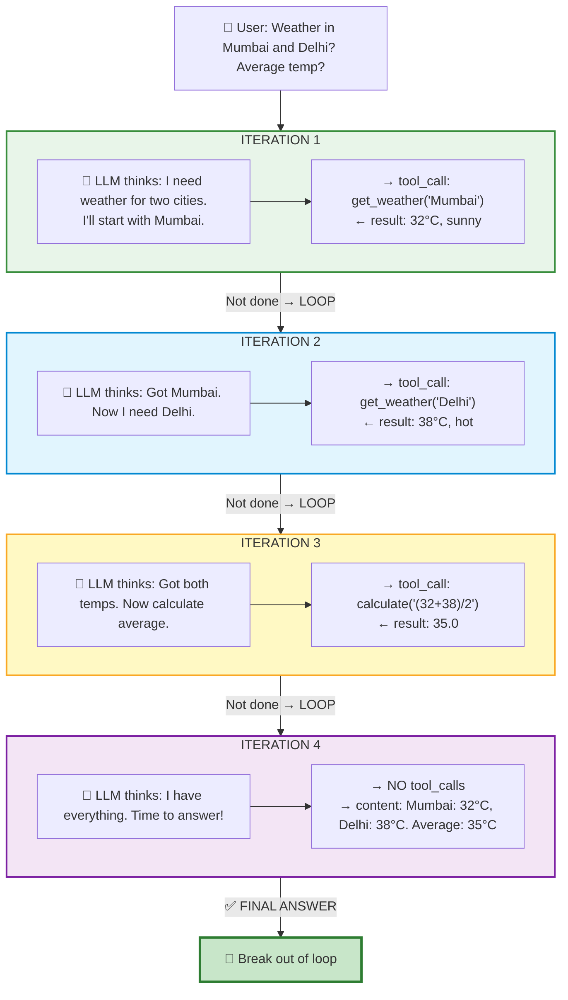

# 📚 Lesson 3.2 — The Agent Loop: Where Chatbots Become Agents

## 🎯 The Moment Everything Clicks

In Lesson 3.1, your assistant handled **one** tool call per question. But real tasks need **multiple steps**:

```
👤 "What's the weather in Mumbai and Delhi? What's the average temperature?"

❌ Lesson 3.1 approach (one tool call):
   → Calls get_weather("Mumbai") → 32°C
   → "The weather in Mumbai is 32°C." (Ignores Delhi and average!)

✅ Agent Loop approach (keeps going until DONE):
   → Calls get_weather("Mumbai") → 32°C
   → Calls get_weather("Delhi") → 38°C  
   → Calls calculate("(32+38)/2") → 35°C
   → "Mumbai is 32°C, Delhi is 38°C. The average is 35°C — quite hot!"
```

> **The Agent Loop = Keep calling the LLM until it says "I'm done, here's my answer."**

This is the single most important pattern in agentic AI. Every framework (LangChain, CrewAI, OpenAI Agents SDK) is just a fancier version of this loop.

**Time:** ~30 minutes  
**Prerequisites:** Lesson 3.1 (function calling works)

---

## 🧠 The Core Idea (30 seconds)

```python
while True:
    response = ask_llm(messages, tools)   # THINK
    
    if response wants to use tools:
        execute the tools                  # ACT
        add results to messages            # OBSERVE
        continue                           # → loop again
    else:
        print(response.content)            # DONE! Final answer
        break
```

That's it. That's the whole agent. Everything else is decoration.

---

## 📊 Visual: What's Happening



**4 LLM calls. 3 tool executions. 1 final answer.** The LLM decided ALL of this on its own.

---

## 🏗️ The Complete Code

```python
"""
🔄 Agent Loop — Your first REAL agent!
Run: python agent_loop.py

Watch it solve multi-step problems by looping until done.
"""
import json
from dotenv import load_dotenv
from openai import OpenAI

load_dotenv()
client = OpenAI()

# ═══════════════════════════════════════════════════════════
# STEP 1: Define your tools (same as Lesson 3.1)
# ═══════════════════════════════════════════════════════════

tools = [
    {
        "type": "function",
        "function": {
            "name": "get_weather",
            "description": "Get current weather for an Indian city",
            "parameters": {
                "type": "object",
                "properties": {
                    "city": {"type": "string", "description": "City name"}
                },
                "required": ["city"]
            }
        }
    },
    {
        "type": "function",
        "function": {
            "name": "calculate",
            "description": "Evaluate a mathematical expression. Use for any math.",
            "parameters": {
                "type": "object",
                "properties": {
                    "expression": {"type": "string", "description": "e.g. '(32+38)/2'"}
                },
                "required": ["expression"]
            }
        }
    },
    {
        "type": "function",
        "function": {
            "name": "get_time",
            "description": "Get current time in a city",
            "parameters": {
                "type": "object",
                "properties": {
                    "city": {"type": "string", "description": "City name"}
                },
                "required": ["city"]
            }
        }
    }
]

# ═══════════════════════════════════════════════════════════
# STEP 2: The actual functions
# ═══════════════════════════════════════════════════════════

def get_weather(city):
    data = {
        "mumbai": {"temp": 32, "condition": "humid and sunny"},
        "delhi": {"temp": 38, "condition": "hot and dry"},
        "bangalore": {"temp": 24, "condition": "pleasant"},
        "chennai": {"temp": 35, "condition": "hot and humid"},
    }
    info = data.get(city.lower())
    if info:
        return f"{city}: {info['temp']}°C, {info['condition']}"
    return f"No weather data for '{city}'. Available: Mumbai, Delhi, Bangalore, Chennai."

def calculate(expression):
    try:
        result = eval(expression)
        return f"{expression} = {result}"
    except Exception as e:
        return f"Error calculating '{expression}': {e}"

def get_time(city):
    # Fake times for demo (in production: use a timezone library)
    times = {
        "mumbai": "11:45 PM IST",
        "delhi": "11:45 PM IST",
        "bangalore": "11:45 PM IST",
        "london": "6:15 PM GMT",
        "new york": "1:15 PM EST",
    }
    return times.get(city.lower(), f"Unknown time for '{city}'")

# Map names → functions (so we can call by name)
available_functions = {
    "get_weather": get_weather,
    "calculate": calculate,
    "get_time": get_time,
}

# ═══════════════════════════════════════════════════════════
# STEP 3: THE AGENT LOOP (the star of the show!)
# ═══════════════════════════════════════════════════════════

def run_agent(user_message, max_iterations=10, verbose=True):
    """
    Run an agent that keeps using tools until it has a final answer.
    
    Args:
        user_message: What the user asked
        max_iterations: Safety limit (prevents infinite loops)
        verbose: Print what's happening at each step
    """
    if verbose:
        print(f"\n{'='*60}")
        print(f"👤 User: {user_message}")
        print(f"{'='*60}")
    
    # Initialize conversation
    messages = [
        {"role": "system", "content": 
            "You are a helpful assistant with access to tools. "
            "Use tools when you need real data or calculations. "
            "You can call multiple tools across multiple steps. "
            "Only give your final answer when you have ALL the information needed."
        },
        {"role": "user", "content": user_message}
    ]
    
    total_tokens = 0
    
    # ─── THE LOOP ───────────────────────────────────────────
    for iteration in range(1, max_iterations + 1):
        if verbose:
            print(f"\n--- Step {iteration} ---")
        
        # THINK: Ask the LLM what to do next
        response = client.chat.completions.create(
            model="gpt-4o-mini",
            messages=messages,
            tools=tools,
            tool_choice="auto"
        )
        
        total_tokens += response.usage.total_tokens
        message = response.choices[0].message
        messages.append(message)  # Always add to history!
        
        # CHECK: Does it want to use tools, or is it done?
        if not message.tool_calls:
            # ✅ NO tool calls → FINAL ANSWER!
            if verbose:
                print(f"\n✅ FINAL ANSWER (after {iteration} steps, {total_tokens} tokens):")
                print(f"🤖 {message.content}")
            return message.content
        
        # 🔧 HAS tool calls → Execute them and loop again
        for tool_call in message.tool_calls:
            func_name = tool_call.function.name
            func_args = json.loads(tool_call.function.arguments)
            
            if verbose:
                print(f"  🔧 Calling: {func_name}({func_args})")
            
            # Execute YOUR function
            if func_name in available_functions:
                result = available_functions[func_name](**func_args)
            else:
                result = f"Error: Unknown function '{func_name}'"
            
            if verbose:
                print(f"  📋 Result: {result}")
            
            # OBSERVE: Feed result back to LLM
            messages.append({
                "role": "tool",
                "tool_call_id": tool_call.id,
                "content": str(result)
            })
        
        # → Loop continues! LLM will see the results and decide next step.
    
    # If we get here, we hit max_iterations without a final answer
    print(f"⚠️ Reached max iterations ({max_iterations}) without final answer!")
    return None

# ═══════════════════════════════════════════════════════════
# STEP 4: Test it!
# ═══════════════════════════════════════════════════════════

if __name__ == "__main__":
    
    # Simple question (1 tool call):
    run_agent("What's the weather in Bangalore?")
    
    # Multi-step question (3 tool calls):
    run_agent("What's the weather in Mumbai and Delhi? What's the average temperature?")
    
    # Complex question (multiple tools):
    run_agent("What time is it in Mumbai? Also, what's the weather there? Should I carry an umbrella?")
    
    # No tools needed:
    run_agent("What is an AI agent? Explain in one sentence.")
```

### Run it:
```bash
python agent_loop.py
```

### Expected output (for the multi-step question):

```
============================================================
👤 User: What's the weather in Mumbai and Delhi? What's the average temperature?
============================================================

--- Step 1 ---
  🔧 Calling: get_weather({'city': 'Mumbai'})
  📋 Result: Mumbai: 32°C, humid and sunny
  🔧 Calling: get_weather({'city': 'Delhi'})
  📋 Result: Delhi: 38°C, hot and dry

--- Step 2 ---
  🔧 Calling: calculate({'expression': '(32+38)/2'})
  📋 Result: (32+38)/2 = 35.0

--- Step 3 ---

✅ FINAL ANSWER (after 3 steps, 487 tokens):
🤖 Here's the weather summary:
- Mumbai: 32°C, humid and sunny
- Delhi: 38°C, hot and dry

The average temperature between the two cities is 35°C. 
Delhi is significantly hotter — stay hydrated if you're there!
```

---

## 🔑 Key Insights

### 1. The LLM decides EVERYTHING

You don't write logic like "if weather question → call weather tool." The LLM reads the question and tools, then decides:
- Which tools to call
- In what order
- When it has enough info
- When to stop and answer

### 2. One iteration can have MULTIPLE tool calls

Notice in Step 1 above: the LLM called `get_weather` TWICE in one response (for Mumbai AND Delhi). It's smart enough to batch related calls.

### 3. The loop exit condition is simple

```python
if not message.tool_calls:  # No tools requested → done!
    return message.content
```

The LLM tells you it's done by simply... not asking for tools.

### 4. `max_iterations` is your safety net

```python
for iteration in range(1, max_iterations + 1):  # Prevents infinite loops
```

Without this, a confused LLM could loop forever. Always set it!

---

## 🆚 Chatbot vs Agent: The Difference

| | Chatbot (Lesson 2.3) | Agent (This Lesson) |
|---|---|---|
| **Flow** | Input → LLM → Output | Input → Loop(LLM ↔ Tools) → Output |
| **Steps** | Always 1 | 1 to N (LLM decides) |
| **Tools** | None | Multiple, iterative |
| **Autonomy** | Zero | High (within the loop) |
| **Code** | `response = llm(messages)` | `while True: response = llm(messages, tools)` |

**The only difference is the loop + tools.** That's what makes it an "agent."

---

## 🧪 TRY IT: Experiment

### Challenge 1: Add a new tool

Add a `convert_temperature` tool:
```python
def convert_temperature(value, from_unit, to_unit):
    """Convert between Celsius and Fahrenheit."""
    if from_unit.lower() == "c" and to_unit.lower() == "f":
        return f"{value}°C = {(value * 9/5) + 32}°F"
    elif from_unit.lower() == "f" and to_unit.lower() == "c":
        return f"{value}°F = {(value - 32) * 5/9}°C"
    return "Unknown conversion"
```

Then ask: *"What's the weather in Mumbai? Convert that temperature to Fahrenheit."*

### Challenge 2: Add iteration tracking

Modify the code to print:
- Total API calls made
- Total tokens used
- Estimated cost

### Challenge 3: Interactive mode

Turn it into a REPL:
```python
while True:
    question = input("\n👤 You: ")
    if question.lower() == "quit":
        break
    run_agent(question)
```

---

## 🚨 Common Issues

### Issue 1: Agent loops forever

**Cause:** Tool returns error, LLM retries same call endlessly.

**Fix:** 
- Set `max_iterations` (you already do!)
- Make error messages helpful: `"Error: city 'xyz' not found. Available: Mumbai, Delhi..."`
- The LLM will read the error and try something different

### Issue 2: Agent doesn't use tools when it should

**Cause:** Tool description is vague.

**Fix:** Make descriptions specific:
```python
# ❌ Bad:
"description": "Gets data"

# ✅ Good:
"description": "Get current weather (temperature, conditions) for an Indian city. Use when user asks about weather, temperature, or climate."
```

### Issue 3: Agent uses wrong tool

**Cause:** Overlapping descriptions.

**Fix:** Make each tool's purpose distinct:
```python
# If you have both "search_web" and "search_notes":
"description": "Search the PUBLIC internet for current information"
"description": "Search my PERSONAL notes and reminders (private data)"
```

---

## 🧠 The Pattern (Memorize This)

Every agent framework is this pattern with extra features:

```python
def agent(user_input, tools, max_steps=10):
    messages = [system_prompt, user_input]
    
    for step in range(max_steps):
        response = llm(messages, tools)     # THINK
        messages.append(response)
        
        if no tool calls:
            return response.content          # DONE
        
        for each tool_call:
            result = execute(tool_call)      # ACT
            messages.append(result)          # OBSERVE
    
    return "Max steps reached"
```

**LangChain?** This pattern + chains + memory.  
**CrewAI?** This pattern × multiple agents.  
**OpenAI Agents SDK?** This pattern + handoffs + guardrails.  

You now understand the foundation of ALL of them.

---

## ✅ Knowledge Check

1. What's the exit condition for the agent loop?
2. Why do we need `max_iterations`?
3. Can the LLM call multiple tools in ONE iteration? (Look at the output above!)
4. Who decides when to stop — you or the LLM?
5. What's the difference between a chatbot and an agent? (One word answer)

---

## 📝 My Notes

```
Number of steps for my multi-step question:


Something the agent did that surprised me:


A tool I want to add for my project:


```

---

**Previous:** [Lesson 3.1 — Function Calling](./3.1-function-calling.md)  
**Next:** [Lesson 3.3 — Memory & Conversation Management](./3.3-memory.md)