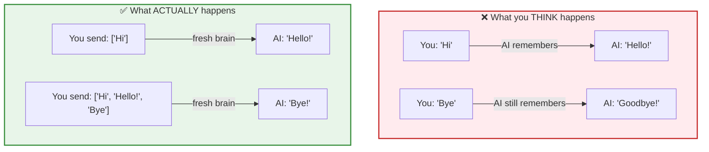
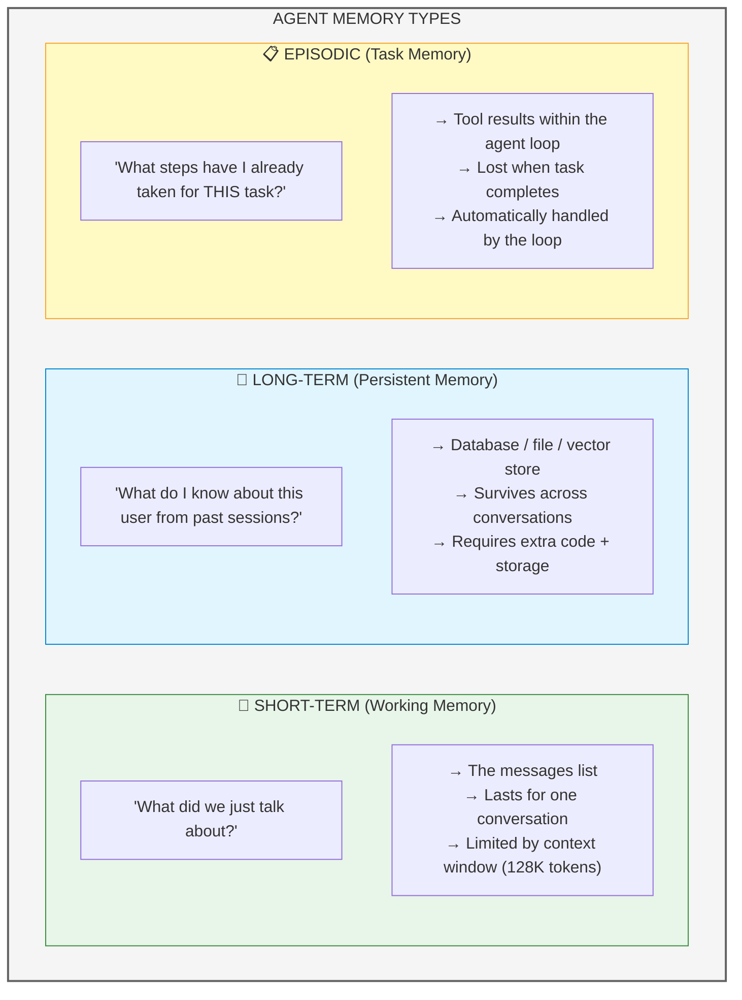

# 📚 Lesson 3.3 — Memory: The Agent's Brain (And Its Limits)

## 🎯 The Problem You've Already Felt

Remember your chatbot from Lesson 2.3? It "remembered" the conversation. But here's the truth:

> **The LLM has ZERO memory. It's completely amnesiac. Every single call is like meeting a stranger.**

```python
# Call 1:
response = llm("My name is Vikiev")
# AI: "Nice to meet you, Vikiev!" 🤝

# Call 2 (5 seconds later):
response = llm("What's my name?")
# AI: "I don't know your name. We just met!" 😶
```

So how did your chatbot work? **YOU** were the memory. You kept resending the entire conversation every time.



> **The AI sees the FULL HISTORY every time. It doesn't "remember" — YOU remind it.**

**Time:** ~25 minutes  
**Prerequisites:** Lesson 3.2 (agent loop)

---

## 🧠 The Three Types of Agent Memory

Just like humans, agents need different kinds of memory:



This lesson focuses on **short-term memory** — the messages list. It's the foundation everything else builds on.

---

## Level 1: The Basic Pattern (You Already Know This)

```python
from dotenv import load_dotenv
from openai import OpenAI

load_dotenv()
client = OpenAI()

# THE MEMORY: just a list!
messages = [
    {"role": "system", "content": "You are a helpful assistant."}
]

def chat(user_input):
    """Send a message. Memory persists between calls."""
    # 1. Add user's message to memory
    messages.append({"role": "user", "content": user_input})
    
    # 2. Send FULL memory to LLM
    response = client.chat.completions.create(
        model="gpt-4o-mini",
        messages=messages  # ← The entire conversation history
    )
    
    # 3. Extract reply
    reply = response.choices[0].message.content
    
    # 4. Add AI's reply to memory (so it's there next time!)
    messages.append({"role": "assistant", "content": reply})
    
    return reply

# Test it:
print(chat("My name is Vikiev"))        # "Nice to meet you, Vikiev!"
print(chat("I'm learning AI agents"))   # "That's exciting! ..."
print(chat("What's my name?"))          # "Your name is Vikiev!" ✅
print(chat("What am I learning?"))      # "AI agents!" ✅
```

### 🧪 TRY IT: See the memory grow

Add this after each `chat()` call:
```python
print(f"   [Memory size: {len(messages)} messages]")
```

Watch it grow: 1 → 3 → 5 → 7 → 9 messages. Every turn adds 2 (user + assistant).

---

## Level 2: The Context Window Problem

### Every model has a limit:

| Model | Context Window | ~Words | ~Pages |
|-------|---------------|--------|--------|
| gpt-4o-mini | 128K tokens | ~96,000 | ~192 |
| gpt-4o | 128K tokens | ~96,000 | ~192 |
| gpt-4.1 | 1M tokens | ~750,000 | ~1,500 |

### What happens when you hit the limit?

```python
# After a VERY long conversation:
messages = [...]  # 130,000 tokens worth of messages

response = client.chat.completions.create(
    model="gpt-4o-mini",  # 128K limit!
    messages=messages
)
# 💥 Error: "This model's maximum context length is 128000 tokens. 
#           However, your messages resulted in 130000 tokens."
```

### 🧪 TRY IT: See token usage

```python
response = client.chat.completions.create(
    model="gpt-4o-mini",
    messages=messages
)
print(f"Input tokens: {response.usage.prompt_tokens}")
print(f"Output tokens: {response.usage.completion_tokens}")
print(f"Total: {response.usage.total_tokens}")
```

After 20 turns of conversation, you might see `prompt_tokens: 3000+`. It adds up fast!

---

## Level 3: Memory Management Strategies

### Strategy 1: Sliding Window (Keep Last N Messages)

```python
def chat_with_window(user_input, max_messages=20):
    """Keep only the last N messages to stay within limits."""
    messages.append({"role": "user", "content": user_input})
    
    # TRIM: Keep system prompt + last N messages
    if len(messages) > max_messages + 1:  # +1 for system prompt
        # Keep: [system] + [last N messages]
        messages_trimmed = [messages[0]] + messages[-(max_messages):]
    else:
        messages_trimmed = messages
    
    response = client.chat.completions.create(
        model="gpt-4o-mini",
        messages=messages_trimmed
    )
    
    reply = response.choices[0].message.content
    messages.append({"role": "assistant", "content": reply})
    return reply
```

**Trade-off:** Fast and simple, but the AI "forgets" early conversation.

```
Messages: [sys, u1, a1, u2, a2, u3, a3, u4, a4, u5, a5]
Window=6: [sys,             u3, a3, u4, a4, u5, a5]
                         ↑ u1, a1, u2, a2 are GONE
```

### Strategy 2: Summarize Old Messages

```python
def summarize_and_trim(messages, keep_recent=6):
    """Summarize old messages into one, keep recent ones intact."""
    if len(messages) <= keep_recent + 1:
        return messages  # No trimming needed
    
    # Split: old messages to summarize, recent to keep
    system = messages[0]
    old_messages = messages[1:-keep_recent]
    recent_messages = messages[-keep_recent:]
    
    # Ask LLM to summarize the old conversation
    summary_prompt = [
        {"role": "system", "content": "Summarize this conversation in 2-3 sentences. Keep key facts (names, preferences, decisions)."},
        {"role": "user", "content": str(old_messages)}
    ]
    
    summary_response = client.chat.completions.create(
        model="gpt-4o-mini",
        messages=summary_prompt,
        max_tokens=100
    )
    
    summary = summary_response.choices[0].message.content
    
    # Rebuild: system + summary + recent
    return [
        system,
        {"role": "system", "content": f"Previous conversation summary: {summary}"},
        *recent_messages
    ]
```

**Trade-off:** Preserves key info, but costs an extra API call.

### Strategy 3: Token Counting (Precise Control)

```python
import tiktoken

def count_tokens(messages, model="gpt-4o-mini"):
    """Count tokens in a message list."""
    encoding = tiktoken.encoding_for_model(model)
    total = 0
    for msg in messages:
        total += 4  # overhead per message
        total += len(encoding.encode(msg["content"]))
    return total

def chat_with_token_budget(user_input, max_tokens=4000):
    """Trim messages to fit within a token budget."""
    messages.append({"role": "user", "content": user_input})
    
    # Trim from the middle (keep system + recent)
    while count_tokens(messages) > max_tokens and len(messages) > 3:
        # Remove the oldest non-system message
        messages.pop(1)
    
    response = client.chat.completions.create(
        model="gpt-4o-mini",
        messages=messages
    )
    
    reply = response.choices[0].message.content
    messages.append({"role": "assistant", "content": reply})
    return reply
```

Install tiktoken: `pip install tiktoken`

---

## Level 4: The Full Agent with Memory

Combining Lessons 3.1 + 3.2 + 3.3 — an agent that **remembers across conversations** AND **uses tools**:

```python
"""
🧠 Agent with Memory + Tools + Loop
The complete package!
"""
import json
from dotenv import load_dotenv
from openai import OpenAI

load_dotenv()
client = OpenAI()

# ─── TOOLS ──────────────────────────────────────────────────

tools = [
    {
        "type": "function",
        "function": {
            "name": "get_weather",
            "description": "Get weather for a city",
            "parameters": {
                "type": "object",
                "properties": {"city": {"type": "string"}},
                "required": ["city"]
            }
        }
    },
    {
        "type": "function",
        "function": {
            "name": "save_note",
            "description": "Save a note/reminder for the user",
            "parameters": {
                "type": "object",
                "properties": {"note": {"type": "string"}},
                "required": ["note"]
            }
        }
    },
    {
        "type": "function",
        "function": {
            "name": "get_notes",
            "description": "Retrieve all saved notes",
            "parameters": {"type": "object", "properties": {}}
        }
    }
]

# ─── FUNCTIONS ──────────────────────────────────────────────

saved_notes = []  # Simple in-memory storage

def get_weather(city):
    data = {"mumbai": "32°C sunny", "delhi": "38°C hot", "bangalore": "24°C pleasant"}
    return data.get(city.lower(), f"No data for {city}")

def save_note(note):
    saved_notes.append(note)
    return f"Note saved: '{note}' (total notes: {len(saved_notes)})"

def get_notes():
    if not saved_notes:
        return "No notes saved yet."
    return "\n".join(f"- {n}" for n in saved_notes)

available_functions = {
    "get_weather": get_weather,
    "save_note": save_note,
    "get_notes": get_notes,
}

# ─── THE AGENT CLASS ────────────────────────────────────────

class MemoryAgent:
    """An agent with persistent memory, tools, and a loop."""
    
    def __init__(self, system_prompt=None, max_history=30):
        self.system_prompt = system_prompt or (
            "You are a helpful personal assistant. "
            "You remember what users tell you across the conversation. "
            "Use tools when you need real data or to save information."
        )
        self.messages = [{"role": "system", "content": self.system_prompt}]
        self.max_history = max_history
        self.total_tokens_used = 0
    
    def chat(self, user_input):
        """Process a user message. May use tools. Returns final answer."""
        # Add user message to memory
        self.messages.append({"role": "user", "content": user_input})
        
        # Trim if needed (sliding window)
        self._trim_memory()
        
        # Agent loop
        for step in range(10):  # max 10 tool iterations
            response = client.chat.completions.create(
                model="gpt-4o-mini",
                messages=self.messages,
                tools=tools,
                tool_choice="auto"
            )
            
            self.total_tokens_used += response.usage.total_tokens
            message = response.choices[0].message
            self.messages.append(message)
            
            if not message.tool_calls:
                # Final answer!
                return message.content
            
            # Execute tools
            for tool_call in message.tool_calls:
                name = tool_call.function.name
                args = json.loads(tool_call.function.arguments)
                
                if name in available_functions:
                    result = available_functions[name](**args)
                else:
                    result = f"Unknown tool: {name}"
                
                self.messages.append({
                    "role": "tool",
                    "tool_call_id": tool_call.id,
                    "content": str(result)
                })
        
        return "Sorry, I couldn't complete that task."
    
    def _trim_memory(self):
        """Keep memory within limits using sliding window."""
        if len(self.messages) > self.max_history + 1:
            # Keep system prompt + last max_history messages
            self.messages = [self.messages[0]] + self.messages[-(self.max_history):]
    
    def reset(self):
        """Clear all memory. Fresh start."""
        self.messages = [{"role": "system", "content": self.system_prompt}]
        self.total_tokens_used = 0
    
    def show_memory(self):
        """Debug: show current memory state."""
        print(f"\n📋 Memory ({len(self.messages)} messages, {self.total_tokens_used} tokens used):")
        for i, msg in enumerate(self.messages):
            role = msg["role"] if isinstance(msg, dict) else msg.role
            content = msg.get("content", "[tool call]") if isinstance(msg, dict) else (msg.content or "[tool call]")
            preview = str(content)[:60] + "..." if content and len(str(content)) > 60 else content
            print(f"  [{i}] {role}: {preview}")

# ─── TEST IT ────────────────────────────────────────────────

if __name__ == "__main__":
    agent = MemoryAgent()
    
    print("🤖 Memory Agent online! (type 'quit' to exit)")
    print("   Try: 'Remember that my meeting is at 3pm'")
    print("   Then: 'What are my notes?'")
    print("   Or: 'What's the weather in Mumbai?'\n")
    
    while True:
        user_input = input("👤 You: ").strip()
        if user_input.lower() in ['quit', 'exit']:
            print(f"\n📊 Total tokens used this session: {agent.total_tokens_used}")
            break
        if user_input.lower() == 'reset':
            agent.reset()
            print("🔄 Memory cleared!\n")
            continue
        if user_input.lower() == 'memory':
            agent.show_memory()
            continue
        if not user_input:
            continue
        
        reply = agent.chat(user_input)
        print(f"🤖 Agent: {reply}\n")
```

### Example session:

```
🤖 Memory Agent online! (type 'quit' to exit)

👤 You: My name is Vikiev and I live in Mumbai

🤖 Agent: Nice to meet you, Vikiev! How can I help you today?

👤 You: What's the weather like where I live?

🤖 Agent: The weather in Mumbai is 32°C and sunny. ☀️

👤 You: Remember to remind me about my dentist appointment on Friday

🤖 Agent: I've saved that note for you! 📝

👤 You: What are my notes?

🤖 Agent: Here are your saved notes:
- Remind about dentist appointment on Friday

👤 You: What's my name?

🤖 Agent: Your name is Vikiev! 😊
```

Notice: The agent **remembered** the name, **knew** "where I live" = Mumbai, **used tools** for weather and notes — all in one flowing conversation.

---

## 📊 Memory Strategies Comparison

| Strategy | Pros | Cons | Best For |
|----------|------|------|----------|
| **Full history** | Perfect memory | Hits token limit | Short conversations (<20 turns) |
| **Sliding window** | Simple, fast | Forgets old stuff | Chatbots, casual use |
| **Summarize** | Preserves key info | Extra API call, may lose details | Long conversations |
| **RAG** (Module 6) | Scales infinitely | Complex setup | Production agents |

---

## 🔮 Long-Term Memory (Preview)

For memory that survives across sessions (like remembering a user's preferences from yesterday), you need **external storage**:

```python
# Simple file-based long-term memory:
import json

def save_user_profile(user_id, data):
    with open(f"memory_{user_id}.json", "w") as f:
        json.dump(data, f)

def load_user_profile(user_id):
    try:
        with open(f"memory_{user_id}.json") as f:
            return json.load(f)
    except FileNotFoundError:
        return {}

# At conversation start:
profile = load_user_profile("vikiev")
system_prompt = f"You are helping Vikiev. Known facts: {profile}"
```

You'll learn vector databases for this in Module 6 (RAG).

---

## 🧠 The Key Insight

> **You are the memory manager.** The LLM is a genius with amnesia. Every call, YOU decide what it "knows" by choosing what goes in `messages`.

This means:
- **What you include** = what the agent knows
- **What you exclude** = what the agent forgets
- **How you organize it** = how well the agent reasons

This is why prompt engineering and memory management are the #1 skills for building good agents.

---

## ✅ Knowledge Check

1. Does the LLM remember between API calls? → **No! It's stateless.**
2. What IS "memory" for an LLM? → **The messages list you send every time.**
3. What happens at the context window limit? → **Error (or you must trim).**
4. Name 3 memory management strategies. → **Sliding window, summarization, RAG.**
5. In the MemoryAgent class, where is memory stored? → **`self.messages` list.**

---

## 📝 My Notes

```
My memory strategy for my project:


Something I want the agent to "remember" long-term:


Questions I still have:


```

---

## 🎉 Module 3 Complete!

You've built the core of every AI agent:

| Lesson | What You Learned |
|--------|-----------------|
| 3.1 | Function calling — AI requests, you execute |
| 3.2 | Agent loop — keep going until done |
| 3.3 | Memory — you manage what the AI "knows" |

**These three concepts = 90% of what makes an agent an agent.**

In Module 4, you'll see how the OpenAI Agents SDK wraps all this in a clean API — and you'll realize you already understand what it's doing under the hood.

---

**Previous:** [Lesson 3.2 — Agent Loop](./3.2-simple-agent-loop.md)  
**Next:** [Lesson 4.1 — OpenAI Agents SDK](./4.1-openai-agents-sdk.md)