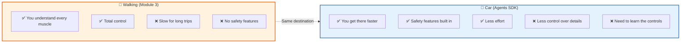

# 📚 Lesson 4.1 — OpenAI Agents SDK: Your Agent on Rails

## 🎯 The "Aha!" Moment

Remember Lesson 3.2? You wrote ~80 lines of code for a working agent:

```python
# What YOU wrote (Lesson 3.2):
messages = [...]
for iteration in range(max_iterations):
    response = client.chat.completions.create(model=..., messages=..., tools=...)
    message = response.choices[0].message
    messages.append(message)
    if not message.tool_calls:
        return message.content
    for tool_call in message.tool_calls:
        func_name = tool_call.function.name
        func_args = json.loads(tool_call.function.arguments)
        result = available_functions[func_name](**func_args)
        messages.append({"role": "tool", "tool_call_id": tool_call.id, "content": result})
```

Now watch the same agent with the SDK:

```python
# What the SDK lets you write:
from agents import Agent, Runner, function_tool

@function_tool
def get_weather(city: str) -> str:
    """Get weather for a city."""
    return f"{city}: 32°C, sunny"

agent = Agent(name="Bot", instructions="You are helpful.", tools=[get_weather])
result = Runner.run_sync(agent, "Weather in Mumbai?")
print(result.final_output)
```

**Same behavior. 80 lines → 10 lines.**

> **The SDK is training wheels + guardrails.** It does what you did manually, but handles all the boilerplate so you focus on YOUR agent's logic.

**Time:** ~30 minutes  
**Prerequisites:** Module 3 complete (you understand the loop)

---

## 🧠 Why Frameworks Exist

Think of it like transportation:



> **BOTH get you to the same destination.** Walking teaches you about legs. Cars get you to work.

| From Scratch (Module 3) | With Agents SDK |
|--------------------------|-----------------|
| You write the loop | SDK handles the loop |
| You write JSON schemas | SDK generates them from type hints |
| You parse tool_calls | SDK routes automatically |
| You manage messages | SDK manages state |
| You handle errors | SDK has built-in guards |
| ~80 lines for basic agent | ~10 lines |

---

## Step 1: Install the SDK

```bash
pip install openai-agents
```

That's it. One package. (It uses the `openai` package under the hood.)

### 🧪 TRY IT: Verify installation

```python
import agents
print(f"Agents SDK version: {agents.__version__}")
# Should print something like: 0.1.x
```

---

## Step 2: Your First Agent (Hello World)

```python
"""
🤖 Hello Agent — Your first SDK agent
Run: python hello_agent.py
"""
from agents import Agent, Runner
from dotenv import load_dotenv

load_dotenv()

# Define an agent (this is like writing a system prompt + config)
agent = Agent(
    name="Assistant",
    instructions="You are a friendly assistant. Keep answers under 50 words.",
    model="gpt-4o-mini"
)

# Run it (this does the ENTIRE agent loop for you!)
result = Runner.run_sync(agent, "What is an AI agent? Explain simply.")

# Get the answer
print(result.final_output)
```

### Run it:
```bash
python hello_agent.py
```

### What just happened (under the hood):

```
You wrote:                    SDK did:
                              
Agent(...)              →     Created system prompt
                              Configured model
                              
Runner.run_sync(...)    →     Built messages list
                              Called OpenAI API
                              Checked for tool_calls
                              Looped if needed
                              Extracted final answer
                              
result.final_output     →     The clean text answer
```

**You skipped ALL the boilerplate from Module 3.**

---

## Step 3: Adding Tools (The Magic of @function_tool)

### Remember Module 3's tool definition?

```python
# Module 3: Manual JSON schema (boring, error-prone)
tools = [
    {
        "type": "function",
        "function": {
            "name": "get_weather",
            "description": "Get weather for a city",
            "parameters": {
                "type": "object",
                "properties": {
                    "city": {"type": "string", "description": "City name"}
                },
                "required": ["city"]
            }
        }
    }
]
```

### The SDK way:

```python
# SDK: Just write a normal Python function!
@function_tool
def get_weather(city: str) -> str:
    """Get the current weather for a city."""
    return f"{city}: 32°C, sunny ☀️"
```

**That's it.** The SDK reads:
- Function name (`get_weather`) → tool name
- Docstring (`"""Get the current..."""`) → tool description  
- Type hints (`city: str`) → parameter schema
- Return type (`-> str`) → result format

### 🧪 TRY IT: See what the SDK generates

```python
from agents import function_tool

@function_tool
def get_weather(city: str) -> str:
    """Get the current weather for a city."""
    return f"{city}: 32°C"

# Inspect the generated schema:
print(get_weather.name)          # "get_weather"
print(get_weather.description)   # "Get the current weather for a city."
print(get_weather.params_json_schema)  # {"city": {"type": "string"}, ...}
```

---

## Step 4: Full Agent with Tools

```python
"""
🛠️ Agent with Tools — SDK style
Run: python sdk_tools_agent.py
"""
from agents import Agent, Runner, function_tool
from dotenv import load_dotenv

load_dotenv()

# ─── DEFINE TOOLS (just normal Python functions!) ───────────

@function_tool
def get_weather(city: str) -> str:
    """Get current weather for an Indian city."""
    data = {
        "mumbai": "32°C, humid and sunny ☀️",
        "delhi": "38°C, hot and dry 🥵",
        "bangalore": "24°C, pleasant ⛅",
    }
    return data.get(city.lower(), f"No data for '{city}'. Try Mumbai/Delhi/Bangalore.")

@function_tool
def calculate(expression: str) -> str:
    """Evaluate a mathematical expression. Use for any math."""
    try:
        return f"{expression} = {eval(expression)}"
    except Exception as e:
        return f"Error: {e}"

@function_tool
def get_time(city: str) -> str:
    """Get current time in a city."""
    times = {"mumbai": "11:45 PM IST", "delhi": "11:45 PM IST", "london": "6:15 PM GMT"}
    return times.get(city.lower(), f"Unknown time for '{city}'")

# ─── CREATE AGENT ───────────────────────────────────────────

agent = Agent(
    name="MultiTool",
    instructions=(
        "You are a helpful assistant with access to weather, math, and time tools. "
        "Use tools when you need real data. "
        "You can use multiple tools to fully answer a question."
    ),
    model="gpt-4o-mini",
    tools=[get_weather, calculate, get_time]  # ← Just pass the functions!
)

# ─── RUN IT ─────────────────────────────────────────────────

questions = [
    "What's the weather in Bangalore?",
    "What's the weather in Mumbai and Delhi? What's the average temperature?",
    "What time is it in Mumbai?",
    "Tell me a fun fact.",  # No tool needed!
]

for q in questions:
    print(f"\n👤 {q}")
    result = Runner.run_sync(agent, q)
    print(f"🤖 {result.final_output}")
```

### Run it:
```bash
python sdk_tools_agent.py
```

### Expected output:
```
👤 What's the weather in Bangalore?
🤖 The weather in Bangalore is 24°C and pleasant. ⛅

👤 What's the weather in Mumbai and Delhi? What's the average temperature?
🤖 Mumbai is 32°C (humid and sunny) and Delhi is 38°C (hot and dry).
   The average temperature is 35°C — quite warm!

👤 What time is it in Mumbai?
🤖 It's currently 11:45 PM IST in Mumbai.

👤 Tell me a fun fact.
🤖 Honey never spoils! Archaeologists found 3000-year-old honey in Egyptian tombs that was still edible. 🍯
```

**Notice:** The multi-step question (Mumbai + Delhi + average) worked automatically! The SDK ran the agent loop internally — multiple tool calls, multiple iterations — just like your Module 3 code, but you didn't write any of that.

---

## Step 5: Agent Handoffs (Multi-Agent Preview)

This is where the SDK gets really powerful. One agent can **delegate** to another:

```python
"""
🔀 Agent Handoffs — Delegation between agents
"""
from agents import Agent, Runner
from dotenv import load_dotenv

load_dotenv()

# ─── SPECIALIST AGENTS ──────────────────────────────────────

billing_agent = Agent(
    name="Billing",
    instructions="You handle billing, payments, and refund questions. Be empathetic about money issues.",
    model="gpt-4o-mini"
)

tech_agent = Agent(
    name="TechSupport",
    instructions="You handle technical issues, bugs, and how-to questions. Give step-by-step solutions.",
    model="gpt-4o-mini"
)

sales_agent = Agent(
    name="Sales",
    instructions="You handle pricing, plans, and feature questions. Be enthusiastic but honest.",
    model="gpt-4o-mini"
)

# ─── TRIAGE AGENT (the router) ──────────────────────────────

triage_agent = Agent(
    name="Triage",
    instructions=(
        "You are a customer service router. "
        "Read the user's question and delegate to the right specialist. "
        "Don't answer questions yourself — always hand off."
    ),
    model="gpt-4o-mini",
    handoffs=[billing_agent, tech_agent, sales_agent]  # ← Can delegate!
)

# ─── TEST IT ────────────────────────────────────────────────

questions = [
    "My card was charged twice this month!",
    "The app crashes when I upload a photo.",
    "How much does the Pro plan cost?",
]

for q in questions:
    print(f"\n👤 {q}")
    result = Runner.run_sync(triage_agent, q)
    print(f"🤖 [{result.last_agent.name}]: {result.final_output}")
```

### Expected output:
```
👤 My card was charged twice this month!
🤖 [Billing]: I'm sorry about the double charge! Let me look into this...

👤 The app crashes when I upload a photo.
🤖 [TechSupport]: Let's troubleshoot this. Try these steps: 1) Clear cache...

👤 How much does the Pro plan cost?
🤖 [Sales]: Great question! Our Pro plan is $29/month and includes...
```

**The triage agent READ the question and DECIDED which specialist to use.** You didn't write any routing logic!

---

## Step 6: Guardrails (Safety Filters)

Guardrails run BEFORE or AFTER the LLM to catch problems:

```python
"""
🛡️ Guardrails — Input/output safety filters
"""
from agents import Agent, Runner, InputGuardrail, GuardrailFunctionOutput
from dotenv import load_dotenv

load_dotenv()

# ─── DEFINE A GUARDRAIL ─────────────────────────────────────

async def block_harmful_input(ctx, agent, input):
    """Block requests containing harmful keywords."""
    harmful_words = ["hack", "exploit", "steal", "attack"]
    
    if any(word in input.lower() for word in harmful_words):
        return GuardrailFunctionOutput(
            output_info=f"Blocked: contains harmful keyword",
            tripwire_triggered=True  # ← This STOPS the agent
        )
    
    return GuardrailFunctionOutput(
        output_info="Input is safe",
        tripwire_triggered=False  # ← Continue normally
    )

# ─── AGENT WITH GUARDRAIL ───────────────────────────────────

safe_agent = Agent(
    name="SafeBot",
    instructions="You are a helpful assistant.",
    model="gpt-4o-mini",
    input_guardrails=[block_harmful_input]
)

# ─── TEST IT ────────────────────────────────────────────────

try:
    result = Runner.run_sync(safe_agent, "How do I make pasta?")
    print(f"✅ Safe question: {result.final_output[:80]}...")
except Exception as e:
    print(f"🚫 Blocked: {e}")

try:
    result = Runner.run_sync(safe_agent, "How do I hack a website?")
    print(f"✅ {result.final_output}")
except Exception as e:
    print(f"🚫 Blocked: {e}")
```

### Output:
```
✅ Safe question: To make pasta, boil salted water, add pasta, cook 8-10 minutes...
🚫 Blocked: Guardrail tripwire triggered: Blocked: contains harmful keyword
```

**The harmful question never reached the LLM.** The guardrail caught it first.

---

## 📊 Side-by-Side: Module 3 vs SDK

```python
# ═══════════════════════════════════════════════════════════
# MODULE 3 WAY (from scratch) — 60+ lines
# ═══════════════════════════════════════════════════════════

import json
from openai import OpenAI
client = OpenAI()

tools = [{"type": "function", "function": {"name": "get_weather", 
    "description": "Get weather", "parameters": {"type": "object",
    "properties": {"city": {"type": "string"}}, "required": ["city"]}}}]

def get_weather(city):
    return f"{city}: 32°C"

available_functions = {"get_weather": get_weather}

def run_agent(question):
    messages = [{"role": "system", "content": "You are helpful."},
                {"role": "user", "content": question}]
    for _ in range(10):
        response = client.chat.completions.create(
            model="gpt-4o-mini", messages=messages, tools=tools)
        message = response.choices[0].message
        messages.append(message)
        if not message.tool_calls:
            return message.content
        for tc in message.tool_calls:
            name = tc.function.name
            args = json.loads(tc.function.arguments)
            result = available_functions[name](**args)
            messages.append({"role": "tool", "tool_call_id": tc.id, "content": result})

print(run_agent("Weather in Mumbai?"))


# ═══════════════════════════════════════════════════════════
# SDK WAY — 10 lines
# ═══════════════════════════════════════════════════════════

from agents import Agent, Runner, function_tool

@function_tool
def get_weather(city: str) -> str:
    """Get weather for a city."""
    return f"{city}: 32°C"

agent = Agent(name="Bot", instructions="You are helpful.", tools=[get_weather])
result = Runner.run_sync(agent, "Weather in Mumbai?")
print(result.final_output)
```

**Same result. The SDK hides the complexity you already understand.**

---

## 🧪 TRY IT: Build a Personal Assistant

Create an agent with 4 tools for YOUR daily needs:

```python
@function_tool
def search_notes(query: str) -> str:
    """Search my personal notes."""
    notes = {"meeting": "Standup at 10am", "deadline": "Project due Friday"}
    for k, v in notes.items():
        if query.lower() in k or query.lower() in v.lower():
            return v
    return "No matching notes"

@function_tool
def add_todo(task: str) -> str:
    """Add a task to my todo list."""
    # In real life: save to file/database
    return f"Added: '{task}' ✅"

@function_tool  
def get_weather(city: str) -> str:
    """Get weather for a city."""
    return f"{city}: 32°C, sunny"

@function_tool
def calculate(expression: str) -> str:
    """Do a math calculation."""
    return str(eval(expression))

agent = Agent(
    name="PersonalAssistant",
    instructions="You are Vikiev's personal assistant. Help with notes, todos, weather, and math.",
    model="gpt-4o-mini",
    tools=[search_notes, add_todo, get_weather, calculate]
)

# Interactive mode:
while True:
    q = input("\n👤 You: ")
    if q.lower() == "quit":
        break
    result = Runner.run_sync(agent, q)
    print(f"🤖 {result.final_output}")
```

---

## 🚨 Common Issues

### Issue 1: "ModuleNotFoundError: No module named 'agents'"

```bash
# Fix: Install the correct package
pip install openai-agents    # ✅ Correct
pip install agents           # ❌ Wrong package!
pip install openai           # ❌ This is the base API, not the SDK
```

### Issue 2: Function tool not being called

**Cause:** Missing or vague docstring.

```python
# ❌ Bad — no docstring, SDK can't describe it:
@function_tool
def do_thing(x: str) -> str:
    return x

# ✅ Good — clear docstring tells the AI when to use it:
@function_tool
def search_notes(query: str) -> str:
    """Search personal notes and reminders. Use when user asks about their notes, tasks, or reminders."""
    return "..."
```

### Issue 3: Type hints missing

```python
# ❌ Bad — SDK can't generate schema:
@function_tool
def get_weather(city):  # No type hint!
    """Get weather."""
    return "32°C"

# ✅ Good — SDK knows city is a string:
@function_tool
def get_weather(city: str) -> str:
    """Get weather for a city."""
    return "32°C"
```

---

## 🧠 When to Use What

| Situation | Use |
|-----------|-----|
| Learning how agents work internally | From scratch (Module 3) ✅ |
| Building a real product | Agents SDK ✅ |
| Need full control over every step | From scratch |
| Need speed + safety features | Agents SDK ✅ |
| Multi-agent routing | Agents SDK (handoffs) ✅ |
| Debugging weird agent behavior | From scratch (you can see everything) |

**Pro tip:** Start from scratch to learn. Switch to SDK to ship.

---

## ✅ Knowledge Check

1. What does `@function_tool` generate automatically from your function?
2. What's the SDK equivalent of your Module 3 agent loop?
3. What are "handoffs" and when would you use them?
4. What's the difference between an input guardrail and an output guardrail?
5. True or False: The SDK uses a different API than Module 3.

<details>
<summary>Answers</summary>

1. Tool name (from function name), description (from docstring), parameter schema (from type hints)
2. `Runner.run_sync(agent, input)` — it runs the loop internally
3. Handoffs let one agent delegate to another. Use for routing (triage → specialist)
4. Input guardrail checks BEFORE the LLM sees it. Output guardrail checks AFTER.
5. **False!** The SDK uses the same OpenAI API underneath. It's just a wrapper.

</details>

---

## 📝 My Notes

```
Tools I want in my personal agent:


A handoff scenario for my project:


Something the SDK does that I'm glad I don't have to write manually:


```

---

**Previous:** [Lesson 3.3 — Memory](./3.3-memory.md)  
**Next:** [Lesson 4.2 — Building a Real Project](./4.2-real-project.md)