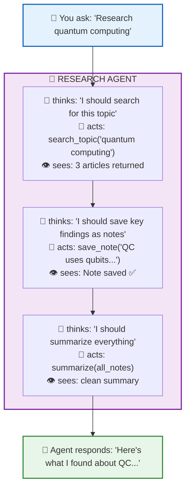
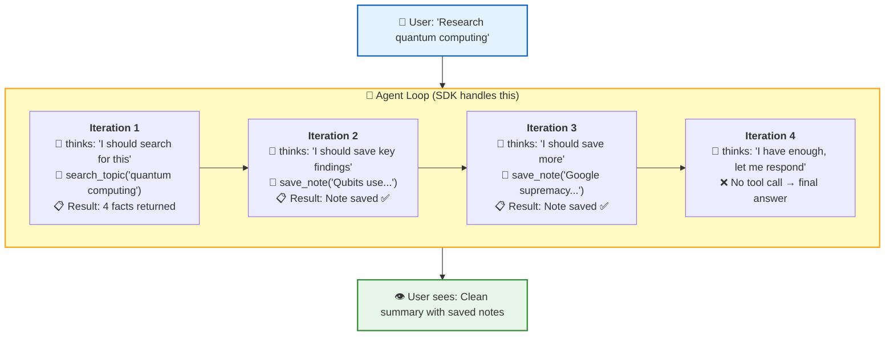

# 📚 Lesson 4.2 — Building a Real Project: Research Agent

## 🎯 What You're Building

A **Personal Research Agent** that can:
- 🔍 Search for information on any topic
- 📝 Take notes while researching
- 📋 Review all saved notes
- 📄 Summarize findings into a report

This combines **everything** from Modules 1–4 into one project.

**Time:** ~45 minutes  
**Prerequisites:** Lessons 4.1 complete

---

## 🧠 The Big Picture



---

## Step 1: Project Structure

```
agentic-ai-learning/code/
└── research_agent.py    ← Everything in one file (keep it simple!)
```

---

## Step 2: The Complete Code

```python
"""
🔬 Research Agent — Your first real AI project
Run: python research_agent.py

This agent can:
- Search topics (simulated database)
- Save research notes
- Review all notes
- Summarize findings
"""
from agents import Agent, Runner, function_tool
from dotenv import load_dotenv

load_dotenv()

# ═══════════════════════════════════════════════════════════
# WORKING MEMORY (notes persist during the session)
# ═══════════════════════════════════════════════════════════

notes: list[str] = []  # ← Our agent's "notebook"

# ═══════════════════════════════════════════════════════════
# FAKE DATABASE (simulates a search engine)
# ═══════════════════════════════════════════════════════════

KNOWLEDGE_BASE = {
    "quantum computing": [
        "Quantum computers use qubits instead of classical bits.",
        "Qubits can be in superposition — both 0 and 1 simultaneously.",
        "Google's Sycamore achieved quantum supremacy in 2019.",
        "Applications: cryptography, drug discovery, optimization.",
    ],
    "artificial intelligence": [
        "AI is the simulation of human intelligence by machines.",
        "Machine Learning is a subset of AI that learns from data.",
        "Deep Learning uses neural networks with many layers.",
        "Current AI excels at pattern recognition tasks.",
    ],
    "blockchain": [
        "Blockchain is a distributed, immutable ledger technology.",
        "Bitcoin was the first major blockchain application (2009).",
        "Smart contracts automate agreements without intermediaries.",
        "Use cases: finance, supply chain, voting systems.",
    ],
    "climate change": [
        "Global temperatures have risen ~1.1°C since pre-industrial times.",
        "CO2 levels are highest in 800,000 years.",
        "Renewable energy adoption is accelerating worldwide.",
        "The Paris Agreement targets limiting warming to 1.5°C.",
    ],
}

# ═══════════════════════════════════════════════════════════
# TOOLS (the agent's capabilities)
# ═══════════════════════════════════════════════════════════

@function_tool
def search_topic(query: str) -> str:
    """Search for information on a topic. Use this to find facts about any subject."""
    query_lower = query.lower()
    
    # Search our knowledge base
    for topic, facts in KNOWLEDGE_BASE.items():
        if topic in query_lower or query_lower in topic:
            results = "\n".join(f"  • {fact}" for fact in facts)
            return f"Found {len(facts)} results for '{topic}':\n{results}"
    
    # If no exact match, try partial match
    for topic, facts in KNOWLEDGE_BASE.items():
        if any(word in topic for word in query_lower.split()):
            results = "\n".join(f"  • {fact}" for fact in facts)
            return f"Found related results for '{topic}':\n{results}"
    
    available = ", ".join(KNOWLEDGE_BASE.keys())
    return f"No results for '{query}'. Available topics: {available}"

@function_tool
def save_note(note: str) -> str:
    """Save a research note. Use this to remember important findings."""
    notes.append(note)
    return f"Note saved ✅ (Total notes: {len(notes)})"

@function_tool
def get_notes() -> str:
    """Get all saved research notes. Use this to review what you've collected."""
    if not notes:
        return "No notes saved yet. Use save_note() to add some."
    
    numbered = "\n".join(f"  {i+1}. {note}" for i, note in enumerate(notes))
    return f"Your research notes ({len(notes)} total):\n{numbered}"

@function_tool
def clear_notes() -> str:
    """Clear all saved notes. Use when starting a new research topic."""
    count = len(notes)
    notes.clear()
    return f"Cleared {count} notes. Fresh start! 🧹"

# ═══════════════════════════════════════════════════════════
# CREATE THE AGENT
# ═══════════════════════════════════════════════════════════

research_agent = Agent(
    name="ResearchBot",
    instructions=(
        "You are a research assistant. Help users explore topics.\n\n"
        "WORKFLOW:\n"
        "1. When asked to research something, use search_topic first\n"
        "2. Save important findings using save_note\n"
        "3. When asked to summarize, review notes with get_notes, then write a summary\n"
        "4. Be thorough but concise\n\n"
        "Available topics: quantum computing, artificial intelligence, blockchain, climate change\n"
        "If user asks about unknown topics, tell them what's available."
    ),
    model="gpt-4o-mini",
    tools=[search_topic, save_note, get_notes, clear_notes]
)

# ═══════════════════════════════════════════════════════════
# INTERACTIVE LOOP
# ═══════════════════════════════════════════════════════════

def main():
    print("🔬 Research Agent Ready!")
    print("   Topics: quantum computing, AI, blockchain, climate change")
    print("   Commands: 'notes' = view notes, 'clear' = reset, 'quit' = exit")
    print("─" * 50)
    
    while True:
        user_input = input("\n👤 You: ").strip()
        
        if not user_input:
            continue
        if user_input.lower() == "quit":
            print("👋 Goodbye! Happy researching!")
            break
        if user_input.lower() == "notes":
            print(f"📋 {get_notes()}")
            continue
        if user_input.lower() == "clear":
            notes.clear()
            print("🧹 Notes cleared!")
            continue
        
        # Run the agent
        result = Runner.run_sync(research_agent, user_input)
        print(f"\n🤖 {result.final_output}")

if __name__ == "__main__":
    main()
```

---

## Step 3: Run It!

```bash
cd agentic-ai-learning/code
python research_agent.py
```

### Example session:

```
🔬 Research Agent Ready!
   Topics: quantum computing, AI, blockchain, climate change
   Commands: 'notes' = view notes, 'clear' = reset, 'quit' = exit
──────────────────────────────────────────────────

👤 You: Research quantum computing

🤖 Here's what I found about quantum computing:

   • Quantum computers use qubits instead of classical bits
   • Qubits can be in superposition — both 0 and 1 simultaneously
   • Google's Sycamore achieved quantum supremacy in 2019
   • Applications include cryptography, drug discovery, and optimization

   I've saved the key findings as notes for your reference.

👤 You: notes
📋 Your research notes (3 total):
   1. Quantum computers use qubits that can be in superposition
   2. Google achieved quantum supremacy in 2019 with Sycamore
   3. Key applications: cryptography, drug discovery, optimization

👤 You: Now research AI and compare

🤖 I found information about artificial intelligence:
   • AI simulates human intelligence by machines
   • Machine Learning learns from data (subset of AI)
   • Deep Learning uses multi-layer neural networks
   
   Compared to quantum computing: AI excels at pattern recognition
   today, while quantum computing promises exponential speedups
   for specific problems. They could combine powerfully!

👤 You: Summarize everything

🤖 ## Research Summary

   **Quantum Computing:** Uses qubits in superposition. Google proved
   quantum supremacy in 2019. Applications in cryptography and optimization.

   **Artificial Intelligence:** Simulates human intelligence. ML and DL
   are key subsets. Excels at pattern recognition.

   **Intersection:** Quantum AI could revolutionize drug discovery
   and complex optimization problems.

👤 You: quit
👋 Goodbye! Happy researching!
```

---

## Step 4: Understand What's Happening

### The Agent Loop (invisible to you, but happening):



**You didn't write this loop!** The SDK does it. But you UNDERSTAND it from Module 3.

---

## Step 5: Key Design Decisions

| Decision | Why | Alternative |
|----------|-----|-------------|
| Notes in a Python list | Simple, no database needed | SQLite, Redis |
| Fake search data | Focus on agent pattern | Real API (Tavily, SerpAPI) |
| Interactive while loop | Real conversation feel | Single-shot, API endpoint |
| Instructions in system prompt | Guides agent behavior | Hard-coded logic |
| `gpt-4o-mini` model | Fast + cheap for learning | `gpt-4o` for production |

---

## Step 6: Extend It (Challenges!)

### 🥉 Easy: Add a new topic

```python
# Add to KNOWLEDGE_BASE:
"space exploration": [
    "SpaceX's Starship is designed for Mars colonization.",
    "The James Webb Telescope launched in December 2021.",
    "NASA's Artemis program aims to return humans to the Moon.",
    "Space tourism is becoming commercially viable.",
],
```

### 🥈 Medium: Save notes to a file

```python
@function_tool
def export_notes() -> str:
    """Export all notes to a markdown file."""
    if not notes:
        return "No notes to export."
    
    content = "# Research Notes\n\n"
    content += "\n".join(f"- {note}" for note in notes)
    
    with open("research_notes.md", "w") as f:
        f.write(content)
    
    return f"Exported {len(notes)} notes to research_notes.md 📄"
```

### 🥇 Hard: Add real web search

```python
# pip install tavily-python
from tavily import TavilyClient

@function_tool
def web_search(query: str) -> str:
    """Search the real internet for information."""
    client = TavilyClient(api_key="your-key")
    results = client.search(query, max_results=3)
    
    formatted = "\n".join(
        f"• {r['title']}: {r['content'][:100]}..."
        for r in results["results"]
    )
    return formatted
```

---

## 🧠 What You've Accomplished

Look at your journey:

```
Lesson 1.1: "An LLM is text in, text out"
     ↓
Lesson 2.3: You made your first API call
     ↓
Lesson 3.1: You gave it tools (function calling)
     ↓
Lesson 3.2: You made it loop (agent loop)
     ↓
Lesson 3.3: You gave it memory
     ↓
Lesson 4.1: You used a framework (Agents SDK)
     ↓
Lesson 4.2: You built a REAL PROJECT ✅
```

**You went from "what is an LLM?" to building a working research agent in 4 modules.**

---

## 🚨 Troubleshooting

### Agent doesn't use tools

**Fix:** Make instructions more explicit:

```python
instructions=(
    "ALWAYS use search_topic when asked about a topic. "
    "ALWAYS save important findings with save_note. "
    "NEVER make up facts — only report what search returns."
)
```

### Agent loops forever

**Fix:** The SDK has a default max turns. You can also set it:

```python
result = Runner.run_sync(research_agent, user_input, max_turns=10)
```

### Notes disappear between runs

**Expected!** Notes are in-memory (Python list). They reset when you restart.
To persist: save to a file or database (see Challenge 🥈 above).

---

## ✅ Knowledge Check

1. How many iterations does the agent loop typically run for "Research X and save notes"?
2. What happens if you ask about a topic NOT in KNOWLEDGE_BASE?
3. Why do we put workflow instructions in the system prompt instead of hard-coding them?
4. What's the difference between `notes` (our list) and conversation history?
5. How would you add a "fact checker" that verifies search results?

<details>
<summary>Answers</summary>

1. Usually 3-5: search → save note(s) → maybe more saves → final response
2. The tool returns "No results" + available topics. The agent tells the user.
3. Because the LLM decides WHEN and HOW to use tools. Hard-coding removes flexibility.
4. `notes` = working memory (persists across questions). Conversation history = the messages list (managed by SDK).
5. Add another agent with a `verify_fact(claim: str)` tool, and use handoffs!

</details>

---

## 📝 My Notes

```
What I want to add to my research agent:


A real project idea using this pattern:


Something that surprised me about how the agent behaves:


```

---

**Previous:** [Lesson 4.1 — OpenAI Agents SDK](./4.1-openai-agents-sdk.md)  
**Next:** [Lesson 5.1 — Multi-Agent Systems](./5.1-multi-agent.md)