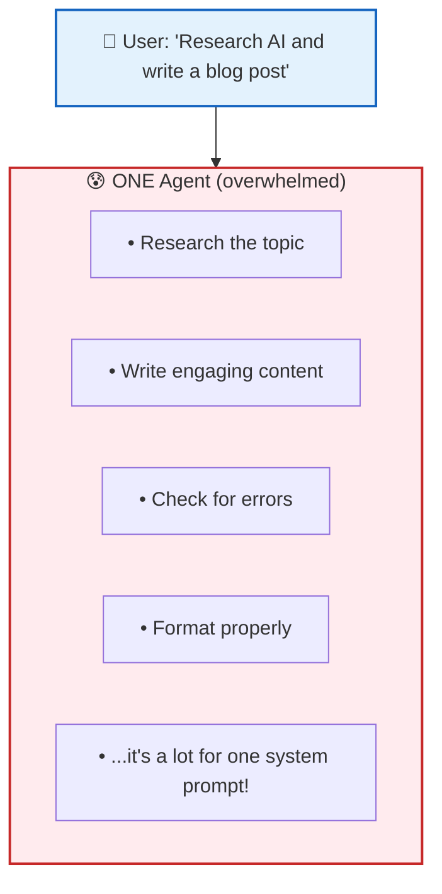
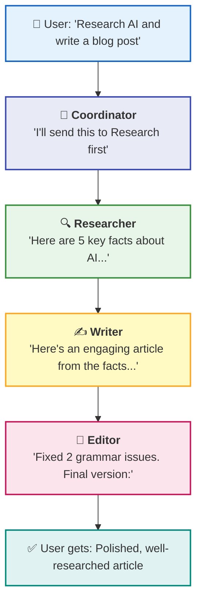
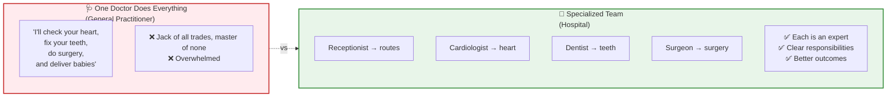
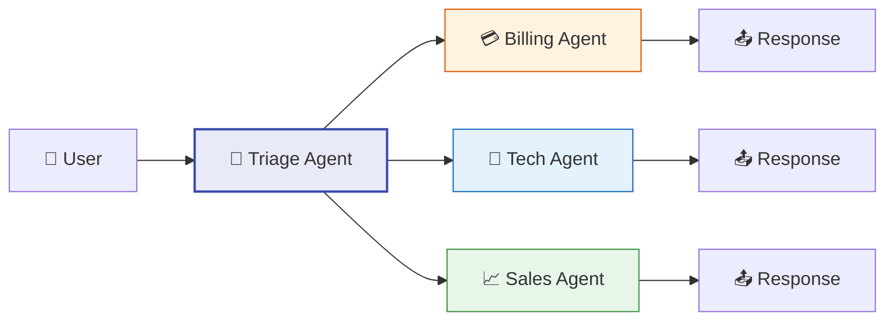
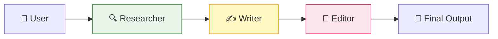
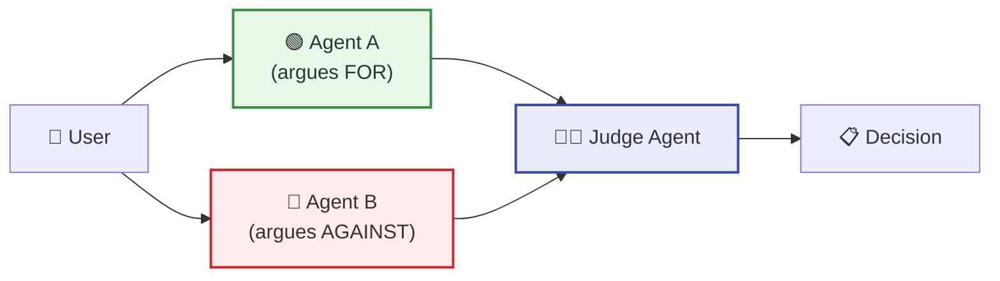
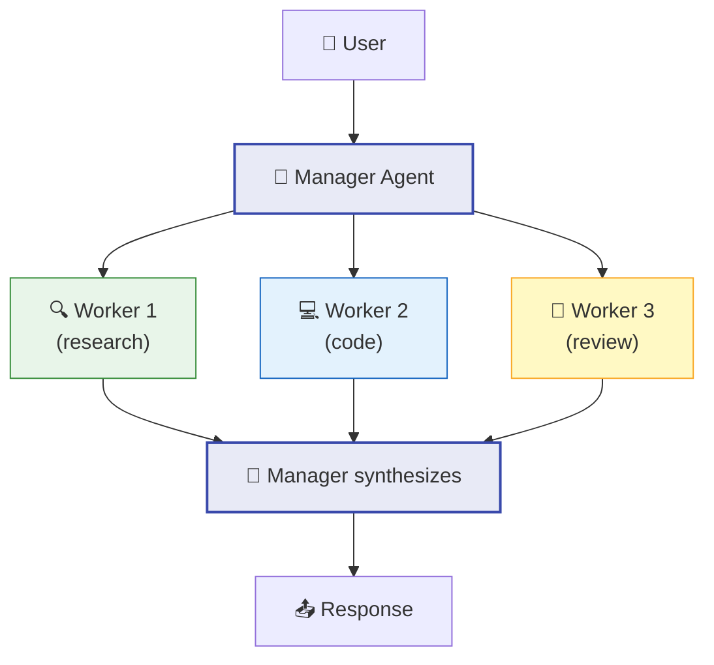
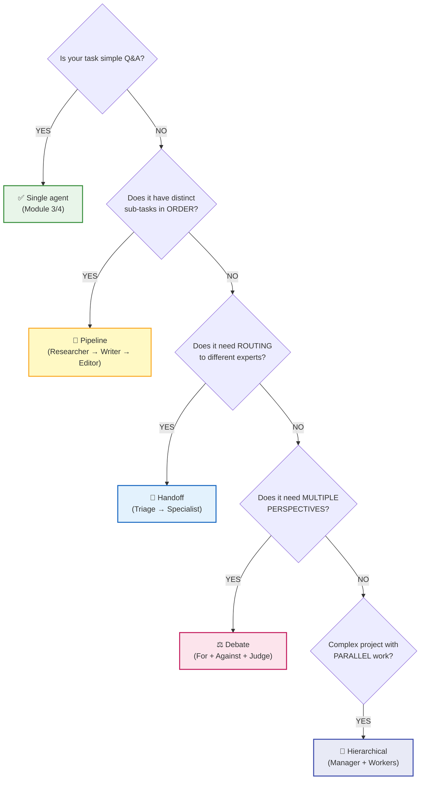

# 📚 Lesson 5.1 — Multi-Agent Systems: A Team of Specialists

## 🎯 The "Aha!" Moment

In Module 4, you built ONE agent that does everything:



Now imagine a **team**:



> **Multi-agent = divide and conquer.** Each agent is an expert at ONE thing.

**Time:** ~40 minutes  
**Prerequisites:** Module 4 complete (Agents SDK, handoffs)

---

## 🧠 Why Multiple Agents?

Think of it like a hospital:



| Single Agent | Multi-Agent |
|--------------|-------------|
| One system prompt for everything | Each agent has focused expertise |
| Gets confused with complex tasks | Each handles its specialty |
| Hard to debug ("why did it do that?") | Clear responsibility per agent |
| One point of failure | Agents can verify each other |
| Fast (one LLM call) | Slower (multiple calls) |

---

## Step 1: The 4 Multi-Agent Patterns

### Pattern 1: Handoff (Router)



**When to use:** Customer support, FAQ routing  
**You saw this in Lesson 4.1!** (triage_agent with handoffs)

### Pattern 2: Pipeline (Assembly Line)



**When to use:** Content creation, data processing  
**Each agent transforms and passes to the next.**

### Pattern 3: Debate (Parallel + Judge)



**When to use:** Decision making, fact checking  
**Multiple perspectives, one final answer.**

### Pattern 4: Hierarchical (Manager + Workers)



**When to use:** Complex projects with parallel sub-tasks

---

## Step 2: Pipeline from Scratch (No Framework!)

This is the SIMPLEST multi-agent pattern. No SDK needed:

```python
"""
🔗 Multi-Agent Pipeline — From scratch
Run: python multi_agent_pipeline.py

Pattern: Researcher → Writer → Editor
"""
from openai import OpenAI
from dotenv import load_dotenv

load_dotenv()
client = OpenAI()

def call_llm(system: str, user: str) -> str:
    """One LLM call = one 'agent'"""
    response = client.chat.completions.create(
        model="gpt-4o-mini",
        messages=[
            {"role": "system", "content": system},
            {"role": "user", "content": user}
        ],
        temperature=0.7
    )
    return response.choices[0].message.content

# ═══════════════════════════════════════════════════════════
# THE PIPELINE: Each "agent" is just an LLM call!
# ═══════════════════════════════════════════════════════════

def content_pipeline(topic: str) -> str:
    print(f"\n📋 Starting pipeline for: '{topic}'")
    print("─" * 50)
    
    # ─── AGENT 1: RESEARCHER ────────────────────────────────
    print("🔍 [Researcher] Working...")
    research = call_llm(
        system=(
            "You are a research specialist. "
            "Find 5 key facts about the given topic. "
            "Be specific and factual. Use bullet points."
        ),
        user=f"Research this topic: {topic}"
    )
    print(f"   Done! Found facts.\n")
    
    # ─── AGENT 2: WRITER ────────────────────────────────────
    print("✍️ [Writer] Working...")
    draft = call_llm(
        system=(
            "You are a professional writer. "
            "Write a short blog post (150-200 words) based on the research. "
            "Make it engaging and easy to read. Add a title."
        ),
        user=f"Write a blog post using this research:\n\n{research}"
    )
    print(f"   Done! Wrote draft.\n")
    
    # ─── AGENT 3: EDITOR ────────────────────────────────────
    print("📝 [Editor] Working...")
    final = call_llm(
        system=(
            "You are a strict editor. "
            "Review the article for: grammar, clarity, accuracy, engagement. "
            "Fix any issues and return the polished final version. "
            "At the end, add a line: '--- Edited by: Editor Agent ---'"
        ),
        user=f"Edit this article:\n\n{draft}"
    )
    print(f"   Done! Final version ready.\n")
    
    return final

# ═══════════════════════════════════════════════════════════
# RUN IT
# ═══════════════════════════════════════════════════════════

if __name__ == "__main__":
    result = content_pipeline("AI agents in healthcare")
    
    print("═" * 50)
    print("📄 FINAL OUTPUT:")
    print("═" * 50)
    print(result)
```

### Run it:
```bash
python multi_agent_pipeline.py
```

### Expected output:
```
📋 Starting pipeline for: 'AI agents in healthcare'
──────────────────────────────────────────────────
🔍 [Researcher] Working...
   Done! Found facts.

✍️ [Writer] Working...
   Done! Wrote draft.

📝 [Editor] Working...
   Done! Final version ready.

══════════════════════════════════════════════════
📄 FINAL OUTPUT:
══════════════════════════════════════════════════
# How AI Agents Are Revolutionizing Healthcare

AI agents are transforming healthcare in remarkable ways...
[polished article here]

--- Edited by: Editor Agent ---
```

### 🧪 TRY IT: Change the pipeline

Add a 4th agent — a "Fact Checker":

```python
# After Editor, add:
print("🔎 [FactChecker] Working...")
verified = call_llm(
    system=(
        "You are a fact checker. Review the article. "
        "Flag any claims that seem exaggerated or unverifiable. "
        "Return the article with corrections if needed."
    ),
    user=f"Fact check this article:\n\n{final}"
)
```

---

## Step 3: Handoff Pattern with Agents SDK

```python
"""
🔀 Multi-Agent Handoff — SDK style
Run: python multi_agent_handoff.py

Pattern: Triage → Specialist
"""
from agents import Agent, Runner
from dotenv import load_dotenv

load_dotenv()

# ─── SPECIALIST AGENTS ──────────────────────────────────────

researcher = Agent(
    name="Researcher",
    instructions=(
        "You are a research specialist. "
        "When given a topic, provide 5 key facts with brief explanations. "
        "Be thorough and cite what you know."
    ),
    model="gpt-4o-mini"
)

writer = Agent(
    name="Writer",
    instructions=(
        "You are a professional content writer. "
        "When given research or a topic, write engaging short-form content. "
        "Use clear language and compelling structure."
    ),
    model="gpt-4o-mini"
)

coder = Agent(
    name="Coder",
    instructions=(
        "You are a senior Python developer. "
        "When given a task, write clean, documented Python code. "
        "Include comments and example usage."
    ),
    model="gpt-4o-mini"
)

# ─── TRIAGE AGENT (the router) ──────────────────────────────

triage = Agent(
    name="Triage",
    instructions=(
        "You are a project coordinator. Read the user's request and "
        "delegate to the right specialist:\n"
        "- Research questions → Researcher\n"
        "- Writing/content tasks → Writer\n"
        "- Coding tasks → Coder\n\n"
        "Always hand off. Never answer directly."
    ),
    model="gpt-4o-mini",
    handoffs=[researcher, writer, coder]
)

# ─── TEST IT ────────────────────────────────────────────────

tasks = [
    "What are the latest trends in renewable energy?",
    "Write a LinkedIn post about remote work",
    "Write a Python function to check if a number is prime",
]

for task in tasks:
    print(f"\n👤 {task}")
    result = Runner.run_sync(triage, task)
    print(f"🤖 [{result.last_agent.name}]:")
    print(f"   {result.final_output[:200]}...")
    print()
```

### Expected output:
```
👤 What are the latest trends in renewable energy?
🤖 [Researcher]:
   Here are 5 key trends in renewable energy:
   1. Solar costs have dropped 89% since 2010...

👤 Write a LinkedIn post about remote work
🤖 [Writer]:
   🏠 Remote work isn't the future — it's the present.
   After 3 years of distributed teams...

👤 Write a Python function to check if a number is prime
🤖 [Coder]:
   ```python
   def is_prime(n: int) -> bool:
       """Check if a number is prime."""
       if n < 2:
           return False
       for i in range(2, int(n**0.5) + 1):
           if n % i == 0:
               return False
       return True
   ```
```

**The triage agent READ each request and routed to the right specialist!**

---

## Step 4: Debate Pattern (Parallel + Judge)

```python
"""
⚖️ Multi-Agent Debate — Two perspectives + a judge
Run: python multi_agent_debate.py
"""
from openai import OpenAI
from dotenv import load_dotenv

load_dotenv()
client = OpenAI()

def call_llm(system: str, user: str) -> str:
    response = client.chat.completions.create(
        model="gpt-4o-mini",
        messages=[
            {"role": "system", "content": system},
            {"role": "user", "content": user}
        ],
        temperature=0.8  # Higher creativity for arguments
    )
    return response.choices[0].message.content

def debate(question: str) -> str:
    print(f"\n⚖️ DEBATE: {question}")
    print("═" * 50)
    
    # ─── AGENT A: ARGUES FOR ────────────────────────────────
    print("🟢 [Agent FOR] arguing...")
    argument_for = call_llm(
        system="You argue IN FAVOR of the proposition. Give 3 strong reasons. Be persuasive.",
        user=f"Argue FOR: {question}"
    )
    
    # ─── AGENT B: ARGUES AGAINST ────────────────────────────
    print("🔴 [Agent AGAINST] arguing...")
    argument_against = call_llm(
        system="You argue AGAINST the proposition. Give 3 strong counter-arguments. Be persuasive.",
        user=f"Argue AGAINST: {question}"
    )
    
    # ─── JUDGE: DECIDES ─────────────────────────────────────
    print("👨‍⚖️ [Judge] deliberating...")
    verdict = call_llm(
        system=(
            "You are an impartial judge. Read both arguments and decide:\n"
            "1. Which side made stronger points?\n"
            "2. What's the nuanced truth?\n"
            "3. Final verdict in 2-3 sentences."
        ),
        user=(
            f"Question: {question}\n\n"
            f"ARGUMENT FOR:\n{argument_for}\n\n"
            f"ARGUMENT AGAINST:\n{argument_against}\n\n"
            "Deliver your verdict."
        )
    )
    
    print("\n" + "═" * 50)
    print("📋 VERDICT:")
    print(verdict)
    return verdict

# ─── RUN DEBATES ────────────────────────────────────────────

debate("Should AI development be paused for safety reasons?")
debate("Is remote work better than office work?")
```

### Expected output:
```
⚖️ DEBATE: Should AI development be paused for safety reasons?
══════════════════════════════════════════════════
🟢 [Agent FOR] arguing...
🔴 [Agent AGAINST] arguing...
👨‍⚖️ [Judge] deliberating...

══════════════════════════════════════════════════
📋 VERDICT:
Both sides raise valid points. The FOR side correctly identifies
existential risks... However, the AGAINST side makes a compelling
case that pausing is impractical... 

Final verdict: Rather than a full pause, targeted safety regulations
and international cooperation offer the best path forward.
```

---

## Step 5: When to Use What



---

## 📊 Frameworks Comparison

| Framework | Pattern | Best For | Complexity |
|-----------|---------|----------|------------|
| **OpenAI Agents SDK** | Handoffs | Simple routing | 🟢 Easy |
| **From scratch** | Pipeline | Learning, control | 🟢 Easy |
| **CrewAI** | Role-based teams | Business workflows | 🟡 Medium |
| **AutoGen** | Conversational | Research, debate | 🟡 Medium |
| **LangGraph** | Graph-based | Complex state machines | 🔴 Hard |

**For this course:** We use OpenAI Agents SDK + from-scratch patterns.

---

## 🧪 TRY IT: Build a Code Review Pipeline

```python
def code_review_pipeline(code: str) -> str:
    """3 agents review code: Security → Performance → Style"""
    
    # Agent 1: Security reviewer
    security = call_llm(
        system="You are a security expert. Find vulnerabilities in this code.",
        user=f"Review for security issues:\n```python\n{code}\n```"
    )
    
    # Agent 2: Performance reviewer
    performance = call_llm(
        system="You are a performance engineer. Find bottlenecks and inefficiencies.",
        user=f"Review for performance:\n```python\n{code}\n```"
    )
    
    # Agent 3: Style reviewer
    style = call_llm(
        system="You are a code style expert. Check PEP8, naming, and readability.",
        user=f"Review for style:\n```python\n{code}\n```"
    )
    
    # Synthesize
    summary = call_llm(
        system="You are a tech lead. Combine these reviews into one actionable summary.",
        user=f"Security review:\n{security}\n\nPerformance:\n{performance}\n\nStyle:\n{style}"
    )
    
    return summary
```

---

## 🚨 Common Issues

### Issue 1: Agents contradict each other

**Cause:** No shared context. Each agent only sees its own input.

**Fix:** Pass previous agent's output as context:
```python
# ❌ Bad — writer doesn't see research:
draft = call_llm("Write about AI", "Write a blog post")

# ✅ Good — writer sees research:
draft = call_llm("Write based on research", f"Research:\n{research}\n\nWrite a post.")
```

### Issue 2: Pipeline is too slow

**Cause:** 3+ sequential LLM calls = 3x+ latency.

**Fix:** Use parallel calls where possible:
```python
import asyncio

async def parallel_review(code):
    security, performance, style = await asyncio.gather(
        call_llm_async("Security expert", code),
        call_llm_async("Performance expert", code),
        call_llm_async("Style expert", code),
    )
    return security, performance, style
```

### Issue 3: Triage agent answers instead of routing

**Fix:** Be VERY explicit in instructions:
```python
instructions=(
    "NEVER answer questions yourself. "
    "ALWAYS hand off to a specialist. "
    "If unsure which specialist, choose the closest match."
)
```

---

## ✅ Knowledge Check

1. Name the 4 multi-agent patterns.
2. What's the simplest way to create "multiple agents" from scratch?
3. In a pipeline, how do agents communicate?
4. When is multi-agent OVERKILL?
5. What's the difference between Handoff and Pipeline?

<details>
<summary>Answers</summary>

1. Handoff (router), Pipeline (assembly line), Debate (parallel + judge), Hierarchical (manager + workers)
2. Multiple `call_llm()` calls with different system prompts!
3. Via text — one agent's output becomes the next agent's input
4. Simple Q&A, single-domain tasks, when latency matters
5. Handoff = ONE specialist handles it. Pipeline = ALL agents handle it in sequence.

</details>

---

## 📝 My Notes

```
A multi-agent system I want to build:


Which pattern fits my use case?


Something I'm still confused about:


```

---

**Previous:** [Lesson 4.2 — Real Project](./4.2-real-project.md)  
**Next:** [Lesson 6.1 — Structured Outputs](./6.1-structured-outputs.md)