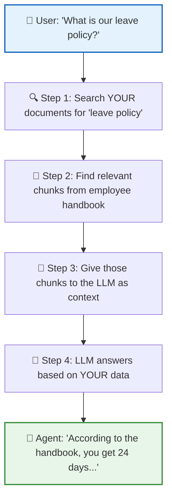
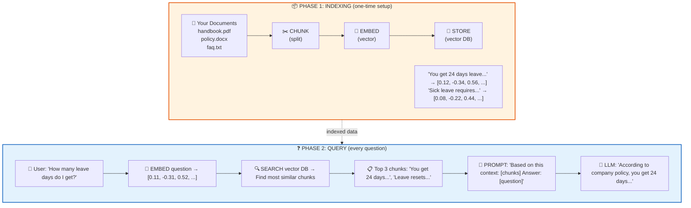

# 📚 Lesson 6.2 — RAG: Teaching AI YOUR Knowledge

## 🎯 The "Aha!" Moment

You ask ChatGPT: "What is our company's leave policy?"

```
ChatGPT: "I don't have access to your company's internal policies..."
```

Of course it doesn't! It was trained on public internet data, not YOUR documents.

**RAG (Retrieval Augmented Generation)** fixes this:



> **RAG = Search your docs → Feed to LLM → Get grounded answers**

This is the **#1 production pattern** for enterprise AI.

**Time:** ~35 minutes  
**Prerequisites:** Module 3 (function calling), Module 4 (agents)

---

## Why RAG?

| Problem | RAG Solution |
|---------|--------------|
| LLM doesn't know your company docs | Retrieve relevant docs, add to prompt |
| LLM hallucinates facts | Ground answers in retrieved context |
| Training data is outdated | Retrieve fresh data at query time |
| Fine-tuning is expensive | RAG is cheap — just a vector DB |

---

## The RAG Pipeline (Two Phases)



---

## Step 1: Install Dependencies

```bash
pip install openai chromadb
```

- `openai` — for embeddings + LLM
- `chromadb` — simple vector database (runs locally, no server!)

---

## Step 2: Chunk Your Documents

```python
def chunk_text(text: str, chunk_size: int = 500, overlap: int = 50) -> list[str]:
    """Split text into overlapping chunks."""
    chunks = []
    start = 0
    while start < len(text):
        end = start + chunk_size
        chunks.append(text[start:end])
        start += chunk_size - overlap  # ← overlap prevents cutting mid-sentence
    return chunks

# Example
document = """
Company Leave Policy:
All full-time employees receive 24 days of paid annual leave per year.
Leave resets on January 1st. Unused leave does NOT carry over.

Sick Leave:
Employees get 12 sick days per year. A doctor's note is required
for absences longer than 3 consecutive days.

Remote Work:
Employees may work remotely up to 2 days per week with manager approval.
"""

chunks = chunk_text(document)
print(f"Split into {len(chunks)} chunks")
```

### Why chunk?

```
❌ Embed entire book → one giant vector → imprecise search
✅ Embed small passages → focused vectors → precise search

Think of it like:
  ❌ Searching a library by "the building"
  ✅ Searching by "specific paragraph"
```

---

## Step 3: Embed and Store

```python
import chromadb
from openai import OpenAI
from dotenv import load_dotenv

load_dotenv()
client = OpenAI()

# Create vector database (in-memory for learning)
chroma = chromadb.Client()
collection = chroma.create_collection("company_docs")

# Get embeddings from OpenAI
def get_embeddings(texts: list[str]) -> list[list[float]]:
    response = client.embeddings.create(
        model="text-embedding-3-small",  # Cheap + fast
        input=texts
    )
    return [item.embedding for item in response.data]

# Index all chunks
embeddings = get_embeddings(chunks)
collection.add(
    documents=chunks,
    embeddings=embeddings,
    ids=[f"chunk_{i}" for i in range(len(chunks))]
)

print(f"Indexed {len(chunks)} chunks ✅")
```

### What's an embedding?

```
"leave policy" → [0.12, -0.34, 0.56, ..., 0.08]  (1536 numbers)
"vacation days" → [0.11, -0.33, 0.55, ..., 0.09]  (very similar!)
"tax law"      → [0.89, 0.12, -0.44, ..., 0.67]  (very different!)

Similar meaning → Similar vectors → Close in "meaning space"
```

---

## Step 4: Retrieve and Generate

```python
def rag_query(question: str) -> str:
    """Full RAG pipeline: retrieve context → generate answer"""
    
    # 1. Embed the question
    q_embedding = get_embeddings([question])[0]
    
    # 2. Search for similar chunks
    results = collection.query(
        query_embeddings=[q_embedding],
        n_results=3  # Top 3 most relevant chunks
    )
    
    # 3. Build context from retrieved chunks
    context = "\n---\n".join(results["documents"][0])
    
    # 4. Ask LLM with context
    response = client.chat.completions.create(
        model="gpt-4o-mini",
        messages=[
            {
                "role": "system",
                "content": (
                    f"Answer based ONLY on this context:\n\n{context}\n\n"
                    "If the context doesn't contain the answer, say "
                    "'I don't have that information.'"
                )
            },
            {"role": "user", "content": question}
        ]
    )
    return response.choices[0].message.content

# ─── TEST IT ────────────────────────────────────────────────
print(rag_query("How many leave days do I get?"))
# → "According to the policy, full-time employees receive 24 days..."

print(rag_query("Can I work from home?"))
# → "Yes, you may work remotely up to 2 days per week..."

print(rag_query("What is the CEO's salary?"))
# → "I don't have that information."
```

---

## Step 5: RAG as an Agent Tool (The Real Power!)

Instead of a fixed pipeline, give your **agent** a search tool:

```python
from agents import Agent, Runner, function_tool

@function_tool
def search_knowledge_base(query: str) -> str:
    """Search company documents for relevant information."""
    q_embedding = get_embeddings([query])[0]
    results = collection.query(query_embeddings=[q_embedding], n_results=3)
    return "\n---\n".join(results["documents"][0])

# Create a RAG-powered agent
support_agent = Agent(
    name="SupportBot",
    instructions=(
        "You are a company support assistant. "
        "Use search_knowledge_base to find answers in company documents. "
        "Only answer based on retrieved information. "
        "If you can't find the answer, say so honestly."
    ),
    model="gpt-4o-mini",
    tools=[search_knowledge_base]
)

# The agent DECIDES when to search!
result = Runner.run_sync(support_agent, "What happens if I'm sick for 5 days?")
print(result.final_output)
# → "For absences longer than 3 consecutive days, a doctor's note is required..."
```

**Why this is better than a fixed pipeline:**
- Agent can search multiple times if needed
- Agent can combine search with other tools
- Agent decides IF searching is even necessary

---

## 🧪 TRY IT: Build a Q&A for Any File

```python
"""
📖 Document Q&A — Ask questions about any text file
Run: python doc_qa.py
"""
import chromadb
from openai import OpenAI
from dotenv import load_dotenv

load_dotenv()
client = OpenAI()
chroma = chromadb.Client()

def get_embeddings(texts):
    response = client.embeddings.create(model="text-embedding-3-small", input=texts)
    return [item.embedding for item in response.data]

def chunk_text(text, size=500, overlap=50):
    chunks = []
    for i in range(0, len(text), size - overlap):
        chunks.append(text[i:i+size])
    return chunks

# Load and index a file
def index_file(filepath: str):
    text = open(filepath, encoding="utf-8").read()
    chunks = chunk_text(text)
    embeddings = get_embeddings(chunks)
    
    collection = chroma.create_collection("docs")
    collection.add(documents=chunks, embeddings=embeddings,
                   ids=[f"c{i}" for i in range(len(chunks))])
    print(f"Indexed {len(chunks)} chunks from {filepath}")
    return collection

# Query it
def ask(collection, question):
    q_emb = get_embeddings([question])[0]
    results = collection.query(query_embeddings=[q_emb], n_results=3)
    context = "\n---\n".join(results["documents"][0])
    
    response = client.chat.completions.create(
        model="gpt-4o-mini",
        messages=[
            {"role": "system", "content": f"Answer from context:\n{context}"},
            {"role": "user", "content": question}
        ]
    )
    return response.choices[0].message.content

# Run
collection = index_file("any_article.txt")
while True:
    q = input("\n❓ Ask: ")
    if q == "quit": break
    print(f"💡 {ask(collection, q)}")
```

---

## Key Concepts Summary

### Embeddings
- A vector (~1536 floats) representing **meaning**
- Similar meanings → similar vectors
- OpenAI models: `text-embedding-3-small` (cheap), `text-embedding-3-large` (better)

### Chunking Strategies

| Strategy | When to use |
|----------|-------------|
| Fixed size (500 chars) | Simple, works for most text |
| By paragraph/section | Structured docs (Markdown, HTML) |
| By sentence | When precision matters |

### Retrieval Quality Tips
- **Top-K**: 3-5 chunks is typical
- **Add "I don't know" instruction**: Prevents hallucination
- **Metadata filtering**: "Only search HR policies" or "Only 2024 docs"

---

## 🚨 Common Pitfalls

| Mistake | Fix |
|---------|-----|
| Chunks too large (2000+ chars) | Use 300-600 chars |
| Chunks too small (50 chars) | Loses context, use 300+ |
| No overlap | Add 50-100 char overlap |
| No "I don't know" instruction | LLM hallucinates without it |
| Stuffing ALL chunks | Use top-K (3-5), not everything |

---

## ✅ Knowledge Check

1. What are the two phases of RAG?
2. What is an embedding?
3. Why do we chunk documents instead of embedding the whole thing?
4. What's the difference between "RAG pipeline" and "RAG as agent tool"?
5. Why add "If you don't know, say so" to the system prompt?

<details>
<summary>Answers</summary>

1. Indexing (chunk → embed → store) and Query (embed question → search → generate)
2. A list of numbers (~1536 floats) that represents the MEANING of text
3. Smaller chunks = more precise retrieval. Whole doc = one blurry vector.
4. Pipeline = always searches. Agent tool = agent DECIDES when to search.
5. Without it, the LLM makes up answers when context is irrelevant (hallucination).

</details>

---

## 📝 My Notes

```
Documents I want to build a RAG system for:


Questions I'd ask:


```

---

**Previous:** [Lesson 6.1 — Structured Outputs](./6.1-structured-outputs.md)  
**Next:** [Lesson 6.3 — Streaming & Error Handling](./6.3-streaming-errors.md)